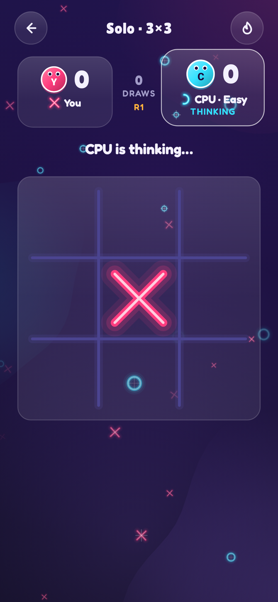
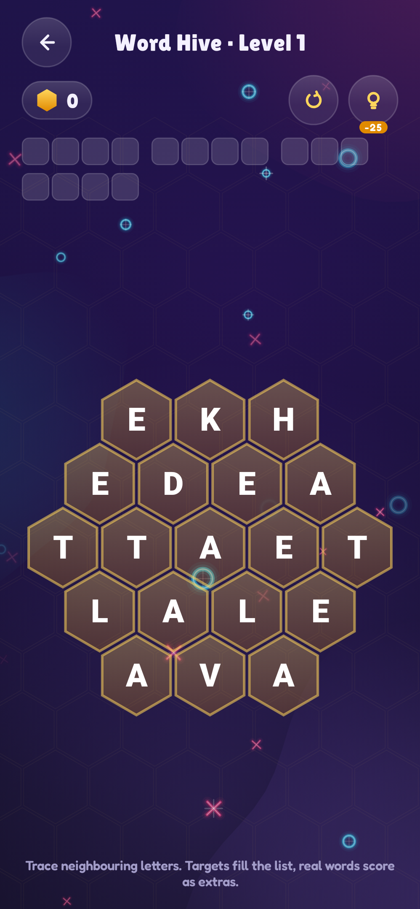
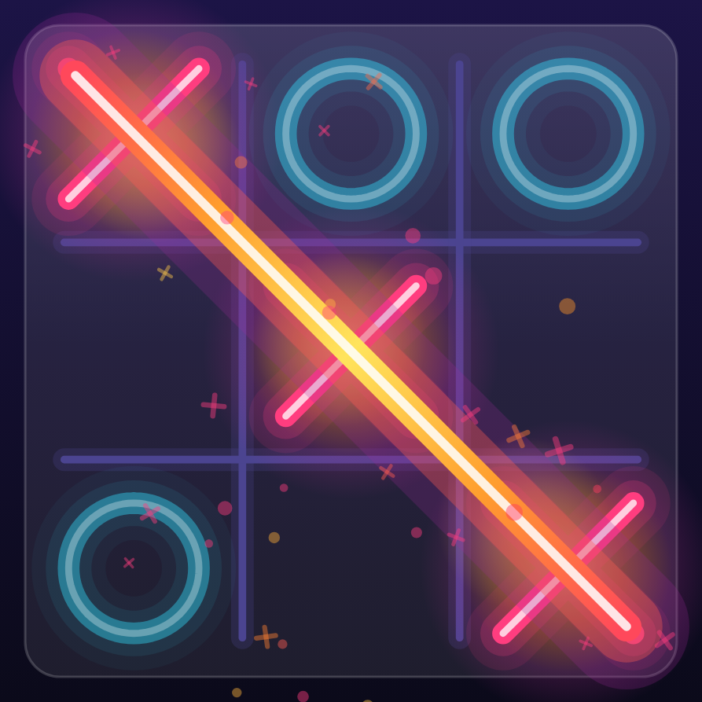
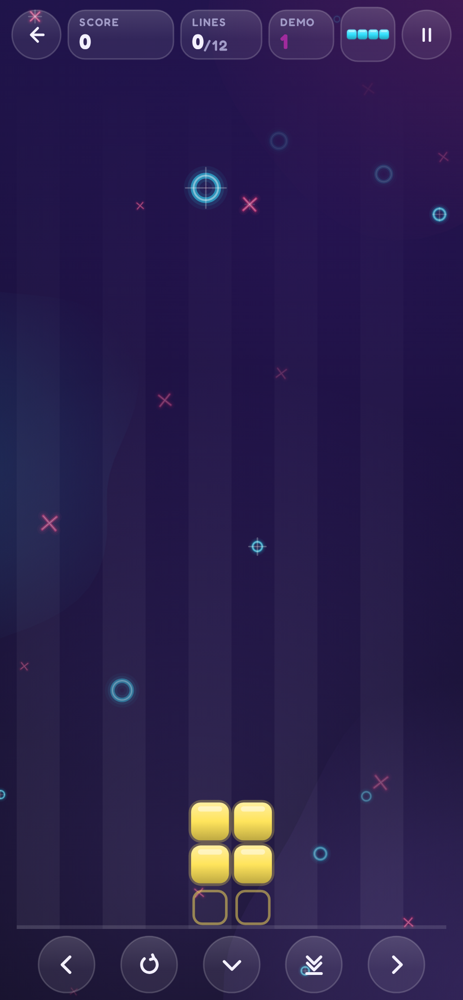

# TTac

A bouncy, neon Tic-Tac-Toe for Android — plus an unlockable arcade — built with Kotlin and Jetpack Compose. Every mark, board, icon, medal and effect is drawn on a Compose `Canvas`; sounds are synthesised in code.

<p align="center">
  
  
  
  
</p>
<p align="center">
  
  
  
</p>

All images are rendered from the app's real composables by Roborazzi screenshot tests.

📖 **[Developer guide](https://kdbrian.github.io/ttac/)** — game development with Compose Canvas, beginner to pro, told through this codebase ·
**[API reference](https://kdbrian.github.io/ttac/api/)**

## Features

**Tic-Tac-Toe**
- Solo vs AI (Easy, Medium, Hard — Hard is perfect on 3×3), Pass & Play, and LAN play between two phones.
- 3×3, 4×4 and 5×5 boards (the larger two need four in a row).
- Marks draw themselves in Neon, Solid or Sketch style; colours, stroke weight and animation speed are configurable.
- The whole screen washes toward the player whose turn it is.
- **Heat**: winning lines burn with a heat-gradient stroke and glowing zones; live threat heat marks cells that would finish a line; a heatmap shows where games are won — felt through gradient, never numbers.

**Streaks & medals**
- A medal every 3 wins in a row: Bronze → Silver → Gold → Platinum → Diamond (Diamond repeats).
- Losing streaks are tracked too, earning Grit badges; snapping a slide earns a Comeback.
- Awards screen with streak meters, a medal cabinet and recent awards.

**LAN**
- Each phone has a lasting random alias (e.g. *Cosmic Otter 42*); addresses are never shown.
- Join by auto-discovery (NSD), by scanning the host's QR code, or by typing a session code.
- Rival history, streaks and a LAN leaderboard per alias.

**Arcade (unlockable)**
- **Blocks** — endless falling-block play on a full-screen well; difficulty sets well size and speed. Unlocked by a 10-win streak.
- **Word Hive** — trace neighbouring letters through a honeycomb; targets, extra words, long-word bonuses, hints and shuffles. Unlocked by 3 Blocks wins in a row.
- Each locked game has one free demo.

## Architecture

| Package | What lives there |
|---|---|
| `game` | Pure Kotlin rules: board, AI (alpha-beta), Blocks engine, Word Hive generator |
| `data` | Stats reducer, medals, unlocks, LAN leaderboard; DataStore settings + JSON stats file |
| `net` | LAN protocol (line-delimited JSON over TCP), NSD discovery, aliases, session codes, QR links |
| `app` | `AppViewModel` (navigation, celebrations) and the `Match` state machine |
| `fx` | Synthesised sound effects and haptics |
| `ui` | Theme, Canvas drawing (marks, boards, medals, glyphs), components and screens |
| `baselineprofile` | Baseline Profile generator and macrobenchmarks |

Everything is stored locally in app-private storage; the only network use is the optional LAN session on your own Wi-Fi.

## Building

Requires JDK 17+ (the Android Studio JBR works) and the Android SDK.

```bash
./gradlew testDebugUnitTest   # unit tests
./gradlew assembleDebug       # debug APK
./gradlew installDebug        # install on a connected device
```

### Performance

A Baseline Profile ships with release builds (via `androidx.profileinstaller`), and the home screen reports full display once saved data has loaded.

```bash
# Regenerate the profile on an API 33+ device, then commit the result
./gradlew :app:generateReleaseBaselineProfile

# Compare cold start with and without the profile, and in-game frame timing
./gradlew :baselineprofile:connectedBenchmarkReleaseAndroidTest
```

## Fonts

[Lilita One](https://github.com/google/fonts/tree/main/ofl/lilitaone) (titles, scores) and [Fredoka](https://github.com/google/fonts/tree/main/ofl/fredoka) (everything else), both from the `google/fonts` repository under the SIL Open Font License 1.1.

## CI & releases

- **CI** (`.github/workflows/ci.yml`) — on every push and pull request: unit tests, lint, debug build and the benchmark module.
- **Release** (`.github/workflows/release.yml`) — on a `v*` tag (or manual run): builds the release APK and AAB and publishes a GitHub release.

To sign releases, add these repository secrets: `KEYSTORE_BASE64` (base64 of your `.jks`), `KEYSTORE_PASSWORD`, `KEY_ALIAS`, `KEY_PASSWORD`. Without them the release APK is unsigned.

```bash
git tag v1.0.0 && git push origin v1.0.0
```
