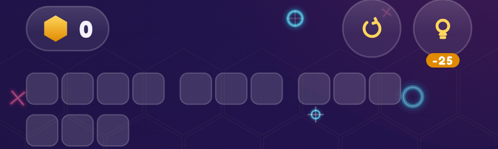
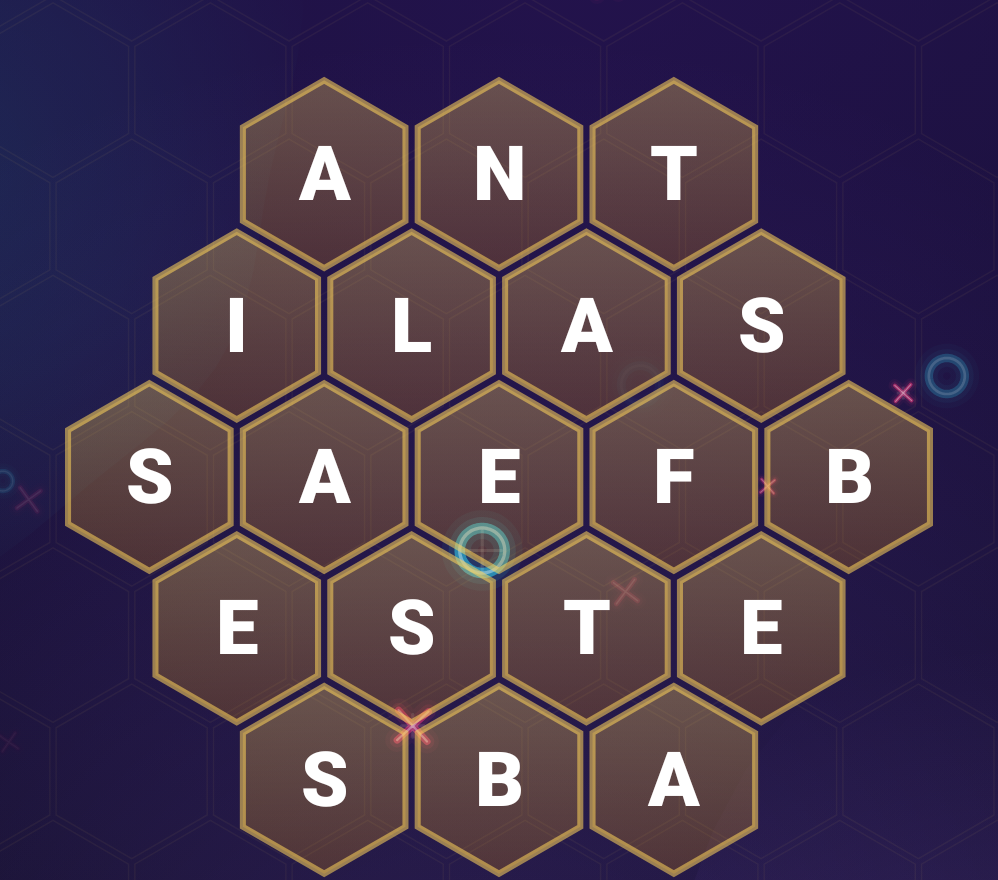

# 15. Word Hive — hex grids & generation 🟠

Word Hive (`game/WordHive.kt` + `ui/screens/HiveScreen.kt`) hides words in a honeycomb. You trace neighbouring letters;
each traced word is **accepted** (a hidden target), counted as an **extra** (a real word that isn't a target), or
**rejected**.

<div class="shots two" markdown>
<figure markdown="span">
{ loading=lazy }
<figcaption>Points, shuffle, hint (with its cost) and the target words as letter boxes</figcaption>
</figure>
<figure markdown="span">
{ loading=lazy }
<figcaption>A radius-2 hive: 19 cells</figcaption>
</figure>
</div>

In the capture: the honey-coin points counter, shuffle and hint buttons (the hint shows its cost), the target words
as rows of empty letter boxes, and a radius-2 hive of 19 cells.

## Hex coordinates

Squares have one obvious coordinate system; hexagons have several. TTac uses **axial coordinates** `(q, r)`, with an
implied third `s = −q − r`:

- The six neighbours of any hex are at `(+1,0) (+1,−1) (0,−1) (−1,0) (−1,+1) (0,+1)`.
- Distance between hexes is `max(|Δq|, |Δr|, |Δs|)` — so "adjacent" is simply distance 1.
- A hive of radius R is every hex with `|q|, |r|, |s| ≤ R`: 19 cells for R = 2, 37 for R = 3, 61 for R = 4.

To draw, convert to pixels for **pointy-top** hexes of size `s`:

```kotlin
fun pos(h: Hex) = center + Offset(sqrt(3f) * s * (h.q + h.r / 2f), 1.5f * s * h.r)
```

Each row is offset half a hex to the right per step of `r`, which is what produces the honeycomb.

## Generating a solvable hive

Words are hidden as **snakes** — paths of adjacent cells — using a randomised depth-first search:

```kotlin
fun walk(path: MutableList<Hex>): Boolean {
    if (path.size == word.length) return true
    for (d in DIRECTIONS.shuffled(random)) {
        val next = path.last() + d
        if (next !in grid || next in path) continue
        if (letters[next] != null && letters[next] != word[path.size]) continue  // may share a matching letter
        path += next
        if (walk(path)) return true
        path.removeAt(path.lastIndex)                                             // backtrack
    }
    return false
}
```

Words can cross through each other where letters match, which packs more words into a small hive. A budget stops
the search on hopeless placements, and the remaining cells are filled with letters weighted by English frequency
(many E, A, R; few K, V).

## Levels

| Level | Radius | Words | Lengths |
|---|---|---|---|
| 1–2 | 2 | up to 4 | 3–4 |
| 3–5 | 3 | up to 7 | 3–6 |
| 6+ | 4 | up to 11 | 4–8 |

## Verdicts and scoring

```kotlin
fun evaluate(path, found, extras): HiveVerdict = when {
    word.length < 3                  -> Rejected
    word in found || word in extras  -> Repeat
    word in targets                  -> Target      // any path spelling it counts
    word in dictionary               -> Extra
    else                             -> Rejected
}
```

Points: targets pay `length × 10 × level`, extras `length × 4 × level`, a hint halves a target's base, and **long
words earn bonuses** — 5 letters *Nice* (+20), 6 *Great* (+50), 7 *Superb* (+90), 8+ *Legendary* (+150), all × level
(halved for extras).

## Shuffle

Shuffling doesn't just permute letters — that could break the hidden paths. It **re-runs the layout** for every
target not yet found, so every remaining word is still traceable, then refills the rest. On screen the hive spins and
squashes while the letters swap at the midpoint of the spin.

## Going further

- Hints escalate: the first reveals a word's first cell (pulsing ring) and letter box; the second reveals the whole
  path and last letter. Each costs `15 + 10 × level` points.
- `WordHiveTest` generates levels 1–9 and asserts every hidden word is spelled by its path, cells are unique and
  adjacent, and shuffles keep unfound words spellable.
