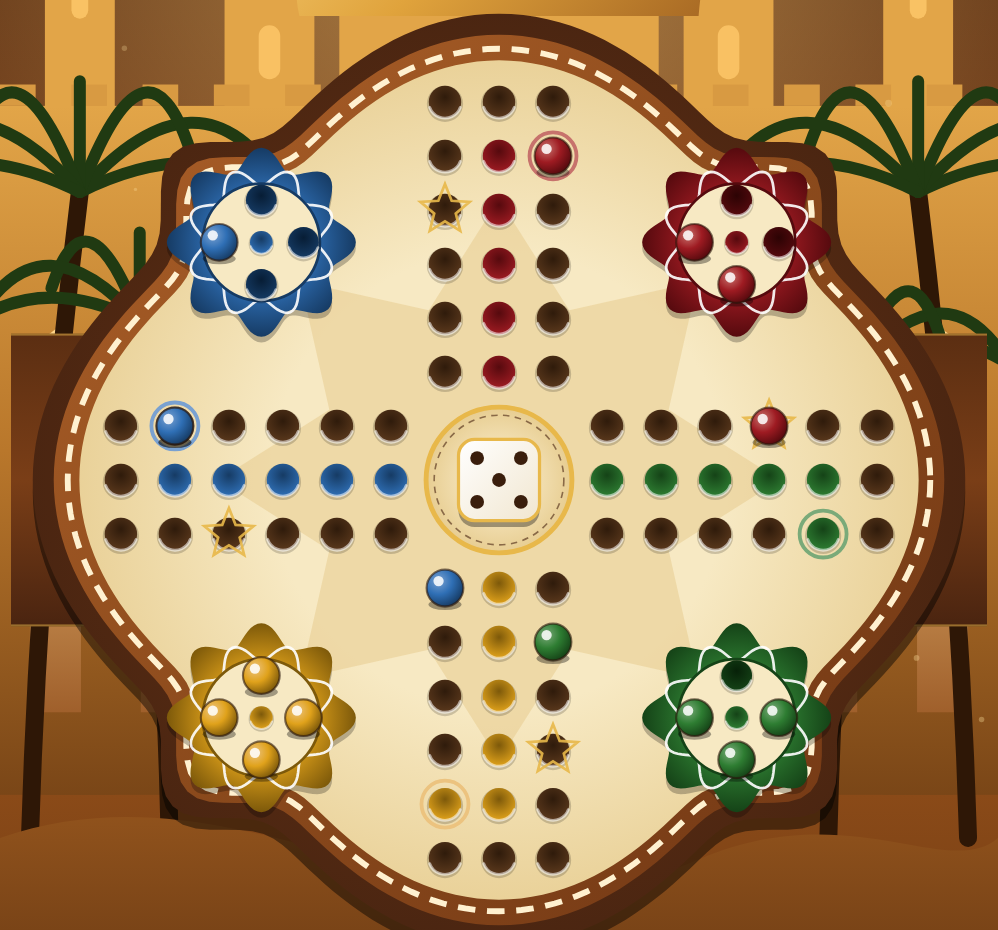
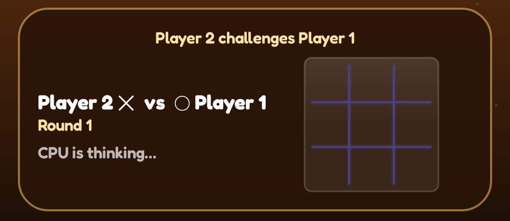
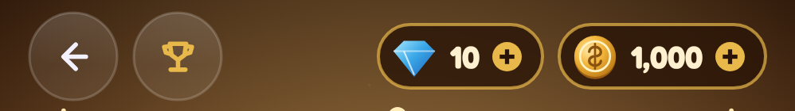
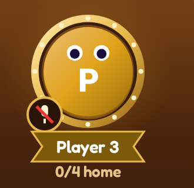
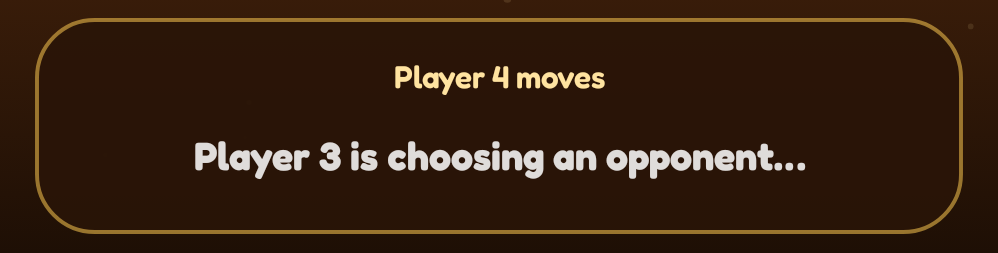
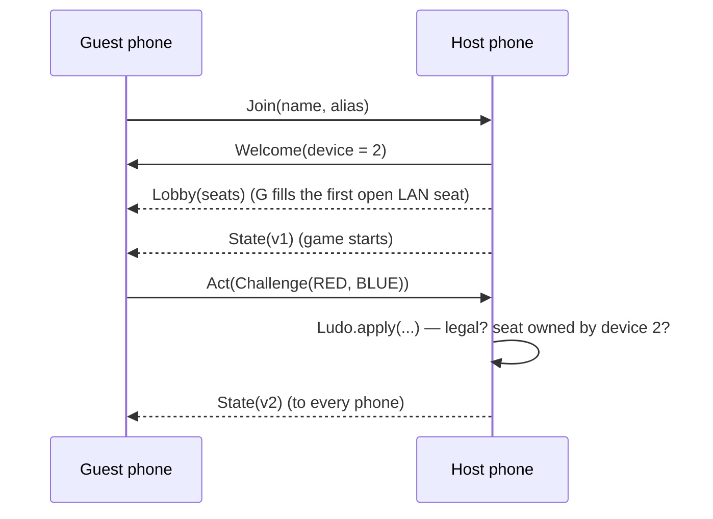
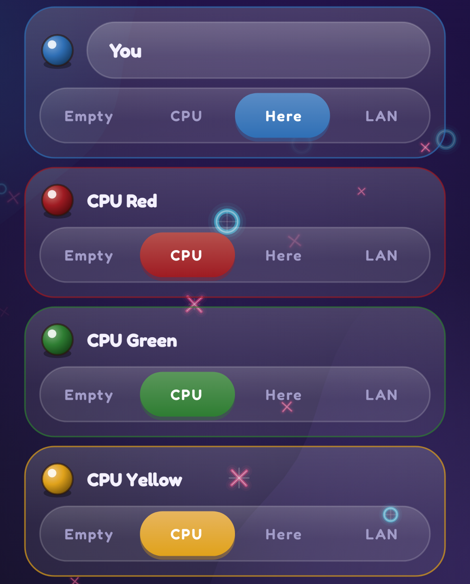
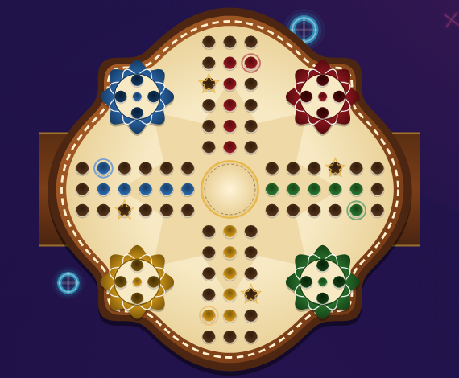
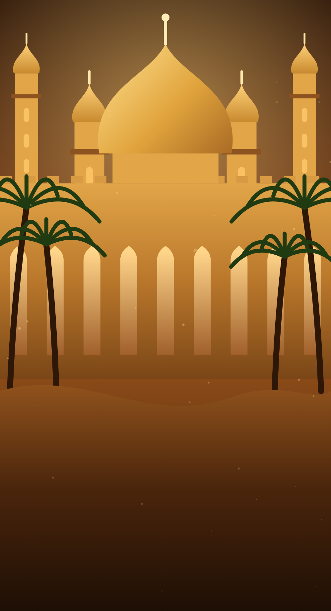

# 16. Ludo Palace — rules, duels & multi-phone LAN 🟠

Ludo Palace (`game/Ludo.kt`, `app/LudoController.kt`, `net/LudoNet.kt`, `ui/screens/LudoScreens.kt`) is a 2–4
player board game where the dice are *earned*: on your turn you challenge anyone at the table to Tic-Tac-Toe, rounds
repeat until someone wins, and the winner rolls and moves.

<div class="shots two" markdown>
<figure markdown="span">
{ loading=lazy }
<figcaption>The board: scalloped frame, carved track, coloured lanes, rosette bases and the die</figcaption>
</figure>
<figure markdown="span">
{ loading=lazy }
<figcaption>A duel for the die — Player 2 (✕) vs Player 1 (◯); the other seats spectate</figcaption>
</figure>
</div>

<div class="shots" markdown>
<figure markdown="span">
{ loading=lazy }
<figcaption>Top bar: back, trophy, gems and coins</figcaption>
</figure>
<figure markdown="span">
{ loading=lazy }
<figcaption>A framed seat: gold ring, mute badge, name ribbon, pawns home</figcaption>
</figure>
<figure markdown="span">
{ loading=lazy }
<figcaption>The action panel: last event and what the table is waiting for</figcaption>
</figure>
</div>

## The board is a 15×15 grid

The classic Ludo cross fits a 15×15 grid: three-cell-wide arms, a 3×3 centre, and four 6×6 corner quadrants (where
the rosette bases sit).

```kotlin
val loop: List<Pair<Int, Int>> = buildList {
    for (c in 0..5) add(c to 6)          // left arm, top row →
    for (r in 5 downTo 0) add(6 to r)    // top arm, left column ↑
    add(7 to 0)                          // top middle
    …                                    // clockwise around all four arms
    add(0 to 7)                          // left middle
}                                        // 6·8 + 4 = 52 squares
```

Two details matter:

- At the four inner corners the track steps **diagonally** — `(5,6)` to `(6,5)` — exactly like a printed board. The
  unit test checks every step is a king's move, not a rook's.
- Each colour starts 13 squares after the previous (`start = 1 + 13 × ordinal`) and turns into its **home lane** from
  the square just before its start — the middle cell of its own arm.

A pawn's position is one number, its **progress**: `−1` in base, `0…50` around the loop, `51…55` up its lane, `56`
home. The loop square is `(start + progress) % 52`, so every colour runs the same arithmetic.

## Rules as a reducer

```kotlin
fun apply(state: LudoState, action: LudoAction, random: Random): LudoState?   // null = illegal
```

| Phase | Who acts | Action |
|---|---|---|
| `CHOOSE_OPPONENT` | the seat whose turn it is | `Challenge(opponent)` |
| `DUEL` | whichever duelist has the move | `DuelMove(cell)` |
| `ROLL` | the duel's winner | `Roll` |
| `MOVE` | the roller | `MovePawn(i)` |

- Leaving base needs a **6**; getting home needs an **exact** roll.
- Landing on a rival on an unsafe square sends it back to base; starts and the square eight on from each start are
  safe.
- A **6** grants another roll straight away — no duel.
- Drawn duels replay with the marks swapped, so nobody keeps the ✕ advantage.
- The turn passes clockwise from the challenger, whoever won the duel.

Because `apply` returns `null` for anything illegal and every action names who's doing it (`action.by`), the same
function is the rule book *and* the anti-cheat check.

## CPUs

`LudoBot` plays duels with the Tic-Tac-Toe AI at the table's difficulty, challenges the rival furthest ahead ("match
me" uses the same rule), and picks pawns by score: capture ≫ bring home ≫ leave base ≫ land on a safe square ≫
advance furthest. A unit test lets four CPUs play whole games to a winner.

## Multi-phone LAN: the host is the authority



- The host runs the only real copy of the game. Guests send **intents** (`Act`); the host checks that the seat
  belongs to the sending device, applies the action with the reducer, and broadcasts the new **state** to everyone.
- Every state carries a `version`; guests ignore anything older than what they have.
- Because every phone renders the same broadcast state, spectating is free — everyone sees the duel board update
  live.
- The same aliases, session codes, QR links and NSD discovery as two-player LAN ([chapter 21](../systems/networking.md)),
  with a separate service type (`_ttacludo._tcp`) and up to three guests.

## Drawing the board

<div class="shots two" markdown>
<figure markdown="span">
{ loading=lazy }
<figcaption>Seats: each colour can be empty, CPU, a player on this phone, or LAN</figcaption>
</figure>
<figure markdown="span">
{ loading=lazy }
<figcaption>The same cached board, drawn small in the lobby</figcaption>
</figure>
</div>

`Modifier.ludoBoardBackground()` draws the static board inside `drawWithCache`, so the frame, holes and rosettes are
built once and replayed — only pawns and the die redraw.

- **The frame** is one polar function: `r(θ) = R·(0.9 + 0.07·cos 4θ) + R·0.13·max(0, −cos 4θ)⁷`. The `cos 4θ` term
  swells four lobes on the axes; the seventh-power term adds sharp ogee tips on the diagonals. Drawn at four scales
  it gives the dark wood, copper band, dashed gold stitching and parchment.
- **Holes** are carved: a drop shadow, a radial gradient darkest at the top, and a light arc on the lower lip.
- **Rosettes** are 8-petal flowers (`1 − d + d·(½ + ½·cos 8θ)`) with a second, rotated petal ring in white.
- **Pawns** hop: each pawn's shown progress is an `Animatable` that runs along the path at ~140 ms per square; the
  fractional part lifts it on a sine arc, and its shadow shrinks while it's airborne.
- **The die** tumbles in with a spring from 540° when a roll lands.

<figure class="single narrow" markdown="span">
{ loading=lazy }
<figcaption>The procedural desert palace behind the table</figcaption>
</figure>

The palace is painted procedurally — dusk gradient, sun glow, minarets with onion caps (two cubic Béziers each),
crenellated walls with lit ogee arches, a great dome, palms (a curved trunk and seven quadratic fronds) and dunes —
cached, with only the dust motes animating.
