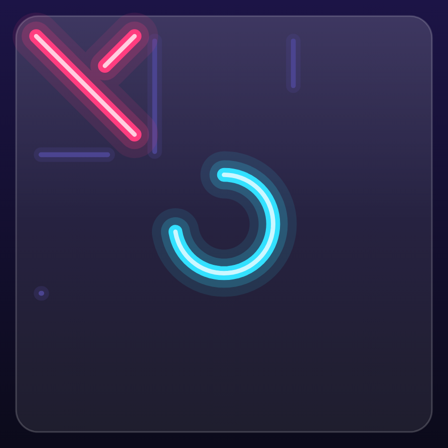
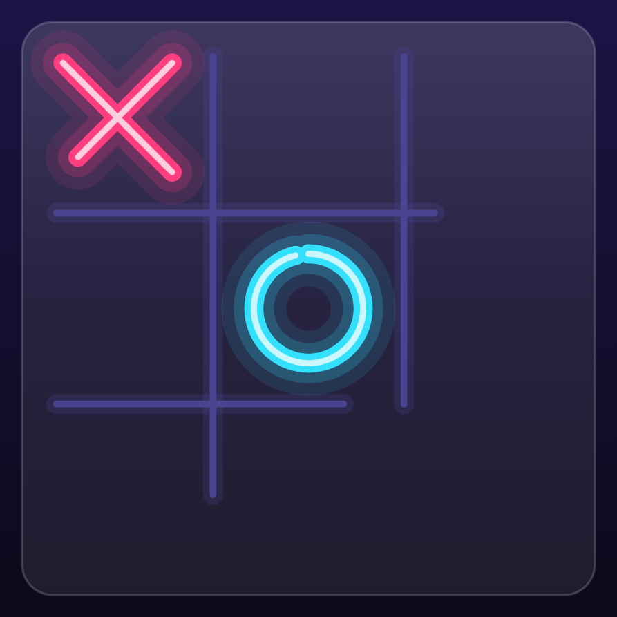
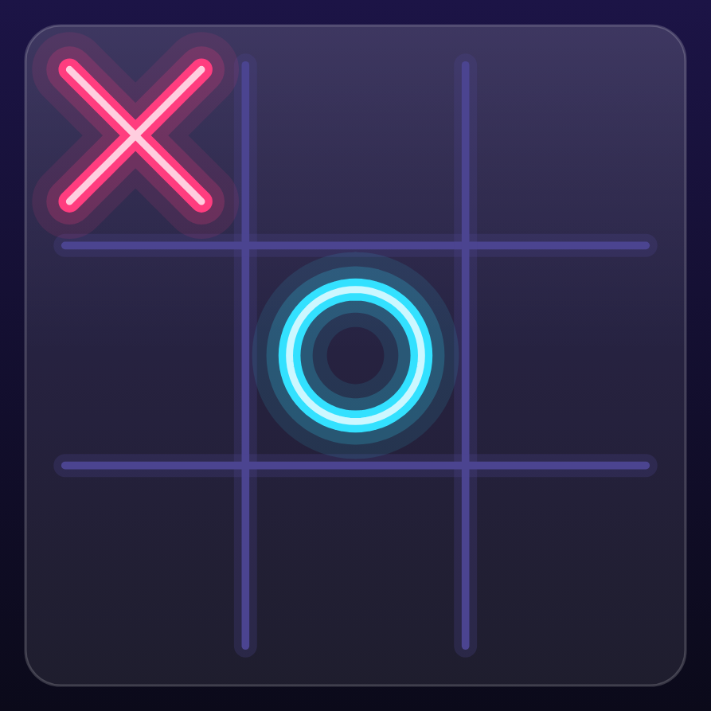

# 5. Animation & motion 🟡

Motion is what makes TTac feel "bouncy". This chapter covers the animation tools it uses, from simplest to most
flexible, and the physics behind springs.

## The toolbox

| API | Good for | Example in TTac |
|---|---|---|
| `animateFloatAsState(target)` | A value that follows a target | Segmented thumb, switch knob, card lift |
| `Animatable(initial)` | Imperative control: snap, animate, sequence | Mark draw-in, win line, particles |
| `rememberInfiniteTransition()` | Loops forever | Pulses, backdrop clock, shine sweeps |
| `AnimatedVisibility` / `AnimatedContent` | Enter/exit of whole composables | Overlays, rolling score digits, screen transitions |
| `keyframes { }` | Hand-authored curves | The board's "disappointed wobble" on a draw |

## Easing vs springs

| Stroke at 180 ms (tween) | Pop overshooting at 300 ms (spring) | Settled at 700 ms |
|---|---|---|
|  |  |  |

- **Linear** moves at constant speed — mechanical.
- **FastOutSlowIn** starts quick and decelerates — natural for things that *arrive*. The mark stroke uses it, which
  is why the first diagonal is already done at 180 ms but the last few percent take longer.
- **Springs** are *physics*, not curves: a mass on a spring with a **damping ratio** and **stiffness**. With
  damping < 1 the value overshoots the target and oscillates back — the ✕ at 300 ms is larger than its final size.

```kotlin
spring(dampingRatio = 0.32f, stiffness = 420f)   // mark pop: bouncy
spring(dampingRatio = 0.85f, stiffness = 1600f)  // Blocks piece glide: snappy, no wobble
```

| dampingRatio | Feel |
|---|---|
| 1.0 | critically damped — fastest settle, no overshoot |
| 0.5–0.75 | a little bounce — buttons, screens |
| 0.3–0.45 | very bouncy — marks, medals popping in |

**Stiffness** sets speed: higher = snappier. Springs also have no fixed duration, which is why they feel right when
interrupted mid-flight — they carry velocity into the new target.

!!! tip "Why springs for UI, tweens for drawing"
    Anything the player *touches* uses springs (buttons, cards, knobs) because interactions interrupt animations.
    Anything that *draws* (strokes, the win line) uses tweens because you want a predictable pen speed.

## Per-cell animations that don't cancel each other

A naive version restarts one animation per board change — and a fast AI reply would cancel the previous mark's
draw-in. TTac gives each cell its own `Animatable` and launches from a scope that outlives the effect:

```kotlin
val draw = remember(roundKey, n) { List(n * n) { Animatable(0f) } }
val scope = rememberCoroutineScope()

LaunchedEffect(board, roundKey) {
    for (i in 0 until board.cellCount) {
        if (board[i] == null || draw[i].targetValue == 1f) continue
        scope.launch { draw[i].animateTo(1f, tween(420, easing = FastOutSlowInEasing)) }
        scope.launch { pop[i].snapTo(0.45f); pop[i].animateTo(1f, spring(0.32f, 420f)) }
    }
}
```

`LaunchedEffect` restarts whenever `board` changes, but the launched animations belong to `scope`, so they finish.

## Staggering

Cascades are a delay per index. `Modifier.popIn(delayMs)` (`ui/components/Components.kt`) springs a composable from
70% scale and 28dp below into place; lists call it with `i * 50`. On the board, grid lines stagger with arithmetic
on one progress value instead of separate animations:

```kotlin
val pV = ((g * 1.5f) - (k - 1) * 0.18f).coerceIn(0f, 1f)   // line k starts 0.18 later
```

One `Animatable`, many staggered results — cheaper and always in sync.

## Frame-rate independence

Never animate by "add 3 pixels per frame" — frame rates vary (60/90/120 Hz). Compose animations are **time-based**:
values are functions of elapsed time, so a spring looks identical on every display. TTac's own simulations follow
the same rule. Particles are a closed-form function of burst progress `b`:

```kotlin
val pos = from + Offset(cos(angle) * speed * b, sin(angle) * speed * b + gravity * b * b)
```

Position depends only on `b` (and a seed), so particles need no per-frame state at all.

## Speed setting

The player's **animation speed** multiplies every duration: `MarkLook.duration(baseMs) = baseMs / animSpeed`. One
line, and the whole board speeds up or slows down consistently.

## Going further

- `Animatable.animateTo` suspends — sequence animations just by calling them in order inside a coroutine.
- `rememberInfiniteTransition` values are read in draw scope, so a 60-second backdrop clock costs no recomposition.
- Loops that must be seamless (the starfield) choose periods that divide the loop length — see
  [Living backdrops](backdrops.md).
