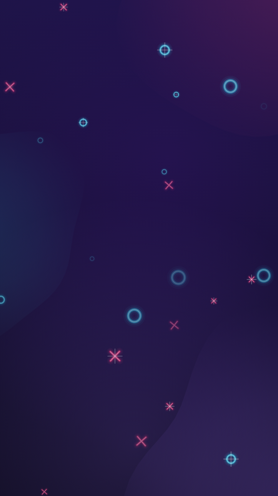
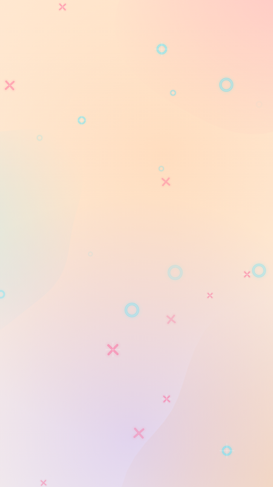

# 8. Living backdrops 🟡

The app never shows a flat background. `AnimatedBackdrop` (`ui/draw/Decor.kt`) layers a gradient, organic blobs,
drifting glows, a player tint and a starfield of ✕ and ◯ — all on one Canvas driven by a single 60-second clock.

| At 2 s | At 4 s | Tinted to ✕ on turn | Light theme |
|---|---|---|---|
|  |  |  |  |

Compare the first two captures of the same backdrop two seconds apart: some stars have faded out, new ones have
appeared elsewhere, and the blobs' edges have shifted.

## One clock, many motions

```kotlin
val t by rememberInfiniteTransition().animateFloat(0f, 1f, infiniteRepeatable(tween(60_000, easing = LinearEasing)))
```

Everything derives from `t`: blob wobble phases, glow drift paths (`sin(t·2π)`, `cos(t·4π)`), and star cycles. Using
integer multiples of `2π·t` guarantees every motion is back where it started when `t` wraps from 1 to 0 — a seamless
loop.

## Layers, back to front

1. **Vertical gradient** from `bgTop` to `bg`.
2. **Three blobs** creeping in from the corners (pink top-right, cyan left, violet bottom-right).
3. **Player wash** — a full-screen vertical gradient in the current player's colour (only during a game).
4. **Two drifting glows** — large radial gradients; the main one swings toward the active player's side.
5. **The starfield**.

## Blobs: polar perturbation

A blob is a circle whose radius varies with angle θ:

$$ r(\theta) = R\,\big(1 + 0.09\sin(3\theta + \phi) + 0.06\sin(5\theta - 1.3\phi) + 0.04\cos(2\theta + 0.7\phi)\big) $$

Low frequencies (2, 3 and 5 bumps around the edge) with small amplitudes give an organic, not spiky, shape; the
phase φ moves with `t`, so the edge undulates slowly. The fill is a radial gradient that fades to transparent, so
blobs bleed softly into the background instead of showing an outline.

The **LAN connection ripples** use the same idea with stronger folds (up to 9%), a travelling phase and ease-out
expansion, which is what makes them feel viscous and cloth-like.

## The starfield

26 stars, each with a **period** (3, 4, 5, 6 or 10 s — all divide 60, so the loop stays seamless) and an **offset**.
Each frame, for each star:

```kotlin
val cycleF = (seconds + s.offset * s.period) / s.period
val cycle = cycleF.toInt()                 // which appearance this is
val local = cycleF - cycle                 // 0..1 through this appearance
val glow = sin(π · local)²                 // fade in → peak → fade out
val rnd = Random(s.seed * 7919 + cycle * 104729)
val pos = Offset(width * rnd.nextFloat(), height * rnd.nextFloat())
```

- `sin²` rises smoothly from 0, peaks in the middle and returns to 0 — the star appears and disappears with no pop.
- The **position is seeded by the cycle number**, so it stays put while visible and moves somewhere new only while
  invisible.
- Size grows from 70% to 100% with the glow, and a tilt of ±12° swings across its life.
- At peak (`glow > 0.8`) a white cross glint flashes.

## The player tint

During a game, `TTacApp` passes `tint` (the current player's colour) and `tintSide` (−1 for ✕, +1 for ◯).
`animateColorAsState` and springs smooth both, so on every turn the whole screen washes toward the new colour and
the main glow swings to that player's side — see the pink-tinted capture above.

## Going further

- All backdrop values are read inside the Canvas lambda → the backdrop never recomposes, only redraws.
- The backdrop sits behind the system bars (edge-to-edge), so there's no seam at the status bar.
