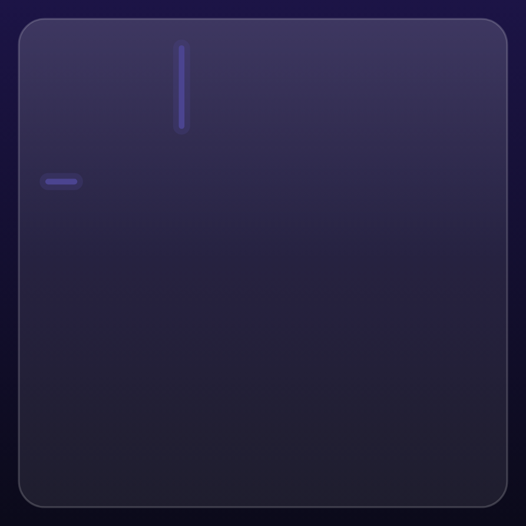
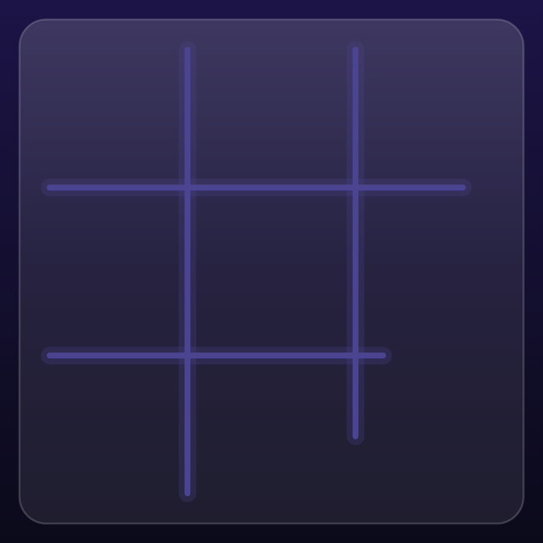
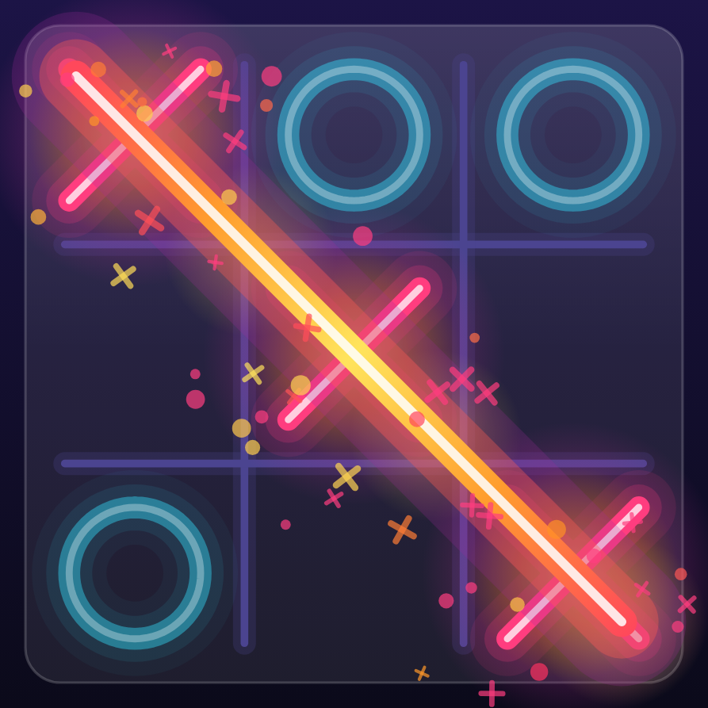
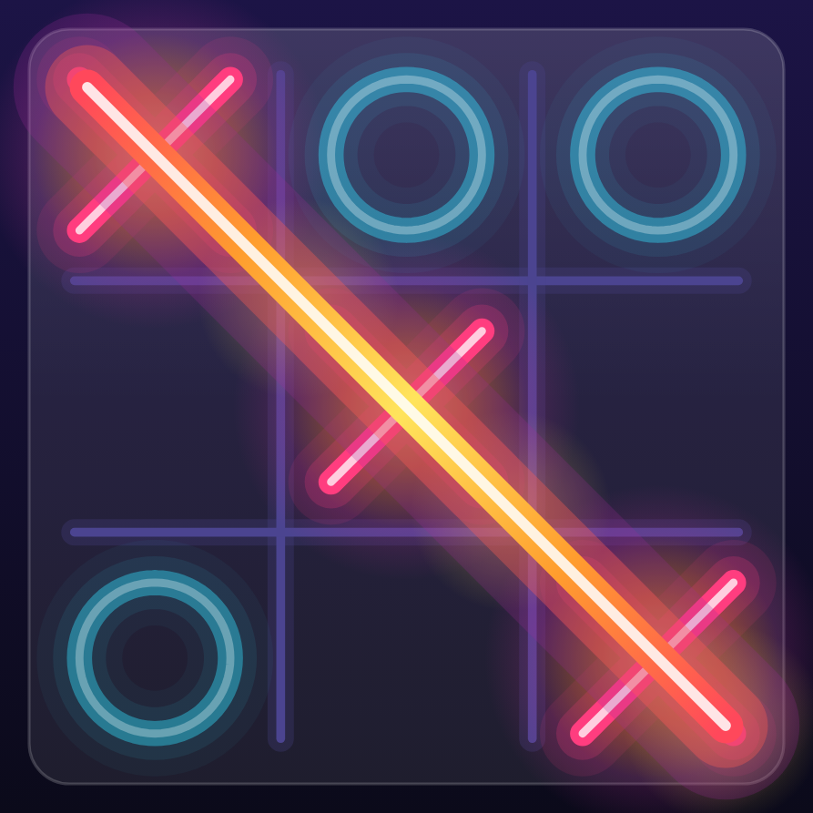

# 6. Rendering the board 🟡

`BoardCanvas` (`ui/draw/BoardCanvas.kt`) is one composable, one `Canvas`, and about a dozen layers. This chapter
walks through a round from the first frame to the celebration.

## The grid draws itself in

<div class="shots" markdown>
<figure markdown="span">
{ loading=lazy }
<figcaption>150 ms</figcaption>
</figure>
<figure markdown="span">
{ loading=lazy }
<figcaption>350 ms</figcaption>
</figure>
<figure markdown="span">
{ loading=lazy }
<figcaption>900 ms</figcaption>
</figure>
</div>

A single `grid` Animatable runs 0 → 1 over 750 ms. Each of the four lines derives its own staggered progress from it
(vertical lines first, horizontals 0.12 later), and draws from its start point to `start + length × progress`. When a
new round begins, `roundKey` changes, `remember(roundKey)` creates a fresh Animatable, and the grid redraws.

## Layer order

```text
1. Glass panel          fill + top sheen + hairline
2. Heatmap              (optional) thermal field, clipped to the panel
3. Grid lines           staggered draw-in, soft glow underlay on dark theme
4. Threat heat          pulsing glows where a line can be completed
5. Tap ripple           expanding ring under the finger
6. Win heat zones       beneath the marks…
7. Marks                …so glows sit *behind* the pieces
8. Win stroke           over the marks
9. Particles            over everything
```

## Taps → cells

```kotlin
detectTapGestures { pos ->
    val c = ((pos.x - origin.x) / cellSize).toInt()
    val r = ((pos.y - origin.y) / cellSize).toInt()
    if (c in 0 until n && r in 0 until n) {
        val idx = r * n + c
        if (currentEnabled && currentBoard[idx] == null) currentOnCell(idx)
    }
}
```

The gesture detector is keyed on `(n, roundKey)` only; the *current* callback and board are read through
`rememberUpdatedState`, so the detector doesn't restart after every move.

## Dimming losers

When a line wins, every non-winning mark fades to 40% as the win stroke burns in:
`alpha = 1 - 0.6 × winProgress`. The eye goes straight to the line.

## The win sequence

<div class="shots" markdown>
<figure markdown="span">
{ loading=lazy }
<figcaption>Ignite (820 ms)</figcaption>
</figure>
<figure markdown="span">
{ loading=lazy }
<figcaption>Burst (1250 ms)</figcaption>
</figure>
<figure markdown="span">
{ loading=lazy }
<figcaption>Settled</figcaption>
</figure>
</div>

After a short delay (so the last mark finishes drawing), two animations start together: `winProgress` (the stroke
and heat zones) and `burst` (particles). They're covered in detail in [Gradients, heat & particles](effects.md).

## Going further

- The board is square by construction: `side = min(width, height)` and an `origin` that centres it, so any aspect
  ratio works.
- The board wobbles on a draw with `keyframes` on a `graphicsLayer` translation — outside the Canvas, so the board
  content doesn't redraw for it.
