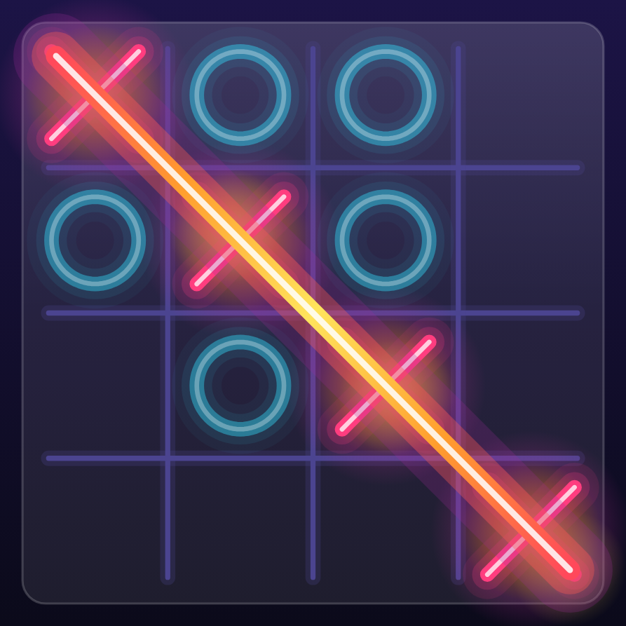
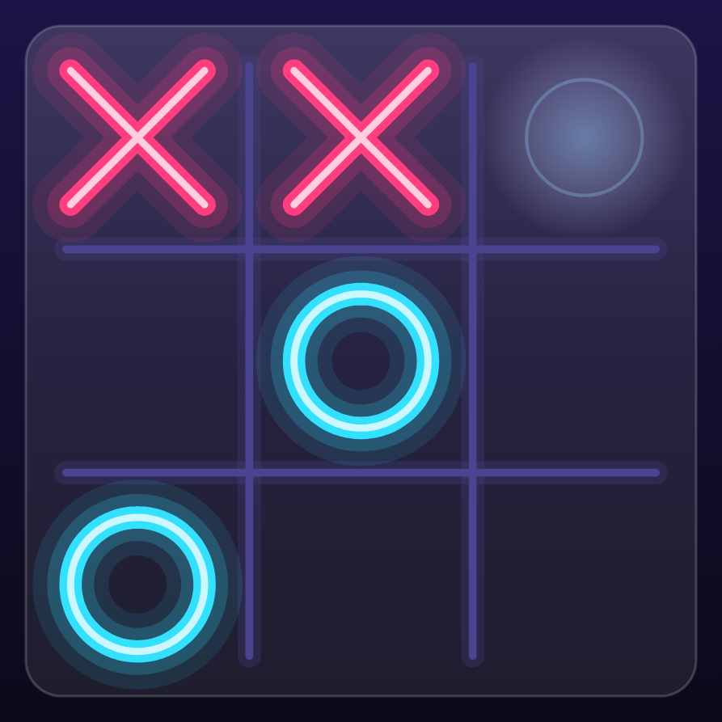
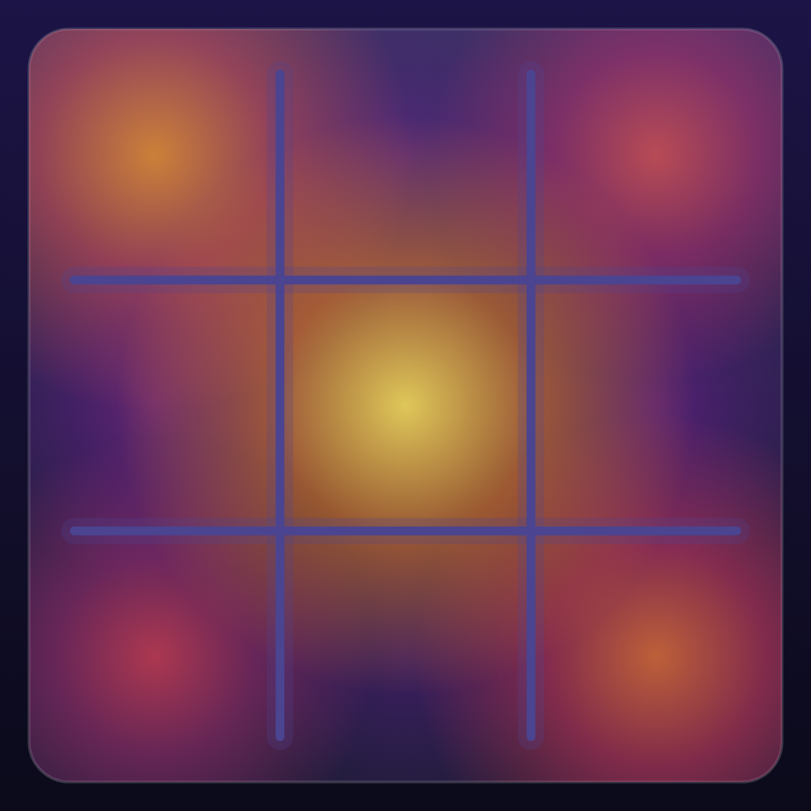

# 7. Gradients, heat & particles 🟡

"Heat" is TTac's visual theme: winning lines burn, dangerous cells glow, and the heatmap shows where games get won.
All of it comes from two ideas — **gradient brushes** and **a colour ramp**.

## Brushes

A `Brush` paints with a gradient instead of a flat colour:

```kotlin
Brush.linearGradient(colors, start, end)        // along a line
Brush.verticalGradient(colors, startY, endY)     // top → bottom
Brush.horizontalGradient(colors)                  // left → right
Brush.radialGradient(colors, center, radius)     // outward from a point
```

Colour **stops** control where each colour sits along the gradient (0 = start, 1 = end):

```kotlin
Brush.radialGradient(
    0f to heat(1f).copy(alpha = 0.55f),     // white-yellow hot core
    0.35f to heat(0.75f).copy(alpha = 0.45f), // orange
    0.7f to heat(0.35f).copy(alpha = 0.22f),  // magenta
    1f to Color.Transparent,                 // no hard edge
    center = c, radius = r,
)
```

That's the brush for each win "heat zone" — the soft glows sitting under the three winning ✕s here:

<figure class="single narrow" markdown="span">
{ loading=lazy }
<figcaption>Heat zones glow beneath the three winning ✕s</figcaption>
</figure>

## The heat ramp

`Palette.heat` is five colours from cold to hot: deep indigo → violet → hot pink → orange → yellow (the light theme
has a paler ramp that reads on paper). `heatAt(t)` samples it anywhere between 0 and 1:

```kotlin
fun Palette.heatAt(t: Float): Color {
    val x = t.coerceIn(0f, 1f) * (heat.size - 1)   // 0..4
    val i = x.toInt().coerceAtMost(heat.size - 2)    // left stop
    return lerp(heat[i], heat[i + 1], x - i)         // blend to the right stop
}
```

Every heat effect in the app — the win line, zones, heatmap, streak meters, Blocks' speed tint — calls `heatAt`, so
"hot" always means the same colour. The light theme has its own ramp, tuned to read on paper.

## Win heat, step by step

```kotlin
// Zones ignite one after another as the stroke passes over them.
val local = ((progress * (cells.size + 1)) - k).coerceIn(0f, 1f)
val r = cell * (0.62f + 0.07f * pulse) * local
```

- `progress` runs 0 → 1; each winning cell `k` gets its own local 0 → 1 slice, so zones light up in sequence.
- `pulse` (an infinite 0 ↔ 1) breathes the radius by ±7%.
- Three "hot spots" flow along the line: positions at `(flow + k/3) % 1` along the stroke, drawn as small radial
  glows.
- The stroke itself is four `drawLine`s — wide faint, medium, a **linear gradient** from the heat ramp, and a thin
  white core. Exactly the neon trick from [chapter 4](marks.md), with a gradient.

<div class="shots" markdown>
<figure markdown="span">
{ loading=lazy }
<figcaption>Ignite (820 ms)</figcaption>
</figure>
<figure markdown="span">
{ loading=lazy }
<figcaption>Burst (1250 ms)</figcaption>
</figure>
<figure markdown="span">
{ loading=lazy }
<figcaption>4×4 win</figcaption>
</figure>
</div>

At 820 ms the stroke is still travelling and only the zones it has passed have lit; at 1250 ms the particle burst is
mid-flight. The same code handles longer lines on bigger boards.

## Threat heat

<figure class="single narrow" markdown="span">
{ loading=lazy }
<figcaption>✕ threatens the top row: the empty cell glows pink</figcaption>
</figure>

`Board.threats(mark)` returns empty cells that would complete a line. Each gets a radial glow in that player's
colour plus a thin ring that shrinks as the glow swells — a pulse you notice peripherally without it shouting.

## The heatmap: felt, not read

<figure class="single narrow" markdown="span">
{ loading=lazy }
<figcaption>The heatmap as a thermal field — no numbers</figcaption>
</figure>

Early versions printed percentages in each cell. The current version draws a **thermal field**:

1. Clip to the board's rounded rectangle.
2. Wash the whole board in the coldest ramp colour.
3. Draw one radial glow per cell, sized `0.55 + 0.55 × v` cells and coloured `heatAt(v)`, **coolest first** so hot
   glows sit on top.
4. Hot cells "breathe": radius × `(1 + 0.1 · v · pulse)`.

Overlapping glows blend into a continuous field, like a thermal camera image.

## Particles without state

<figure class="single narrow" markdown="span">
{ loading=lazy }
<figcaption>56 stateless particles, mid-burst</figcaption>
</figure>

56 particles, zero particle objects. Each frame:

```kotlin
val rnd = Random(particleSeed)          // same seed every frame → same particles
repeat(56) {
    val from = centerOf(win.cells[rnd.nextInt(win.cells.size)])
    val angle = rnd.nextFloat() * 2π
    val speed = cell * (0.8f + rnd.nextFloat() * 1.8f)
    val pos = from + (cos(angle), sin(angle)) * speed * b + (0, gravity * b²)
    …draw a dot or a spinning mini-✕, alpha = 1 - b…
}
```

Replaying a seeded `Random` regenerates identical properties every frame, and position is a closed-form function of
burst progress `b`. There's nothing to update, allocate or leak.

## Going further

- For hundreds of particles you'd precompute them once into arrays (`remember(seed)`) to skip RNG work per frame.
- Radial gradients with transparent edges are cheap "soft circles"; stacking 3–4 gives convincing bloom without a
  blur pass (blur via `RenderEffect` needs API 31 and costs a render pass).
