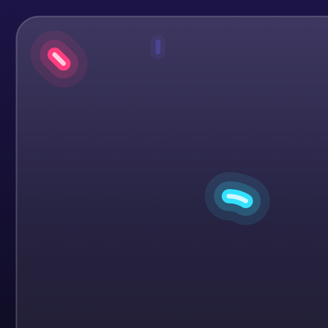
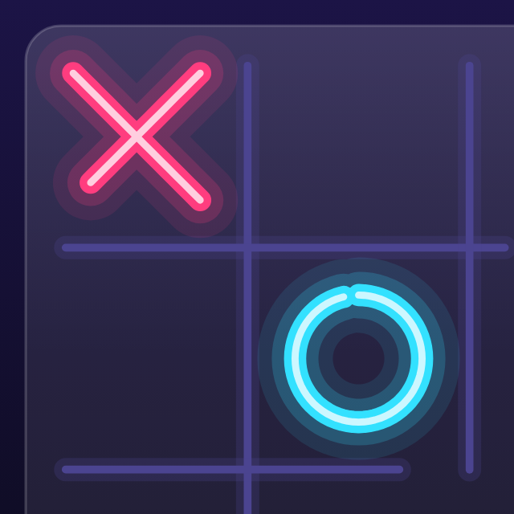
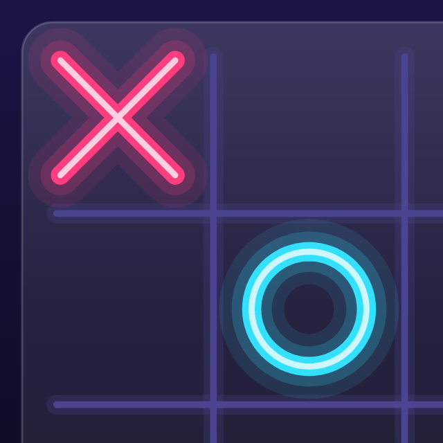
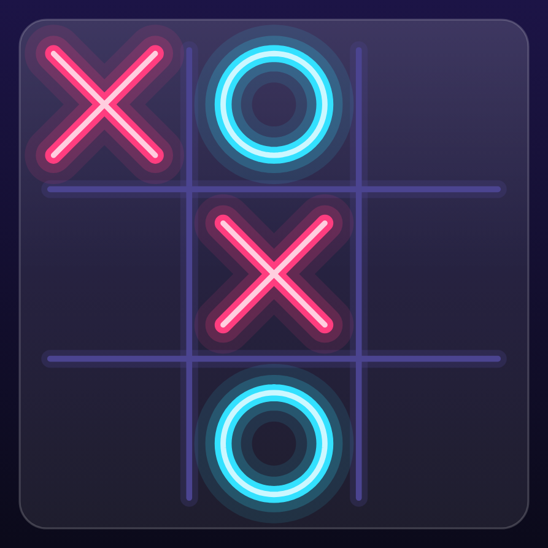
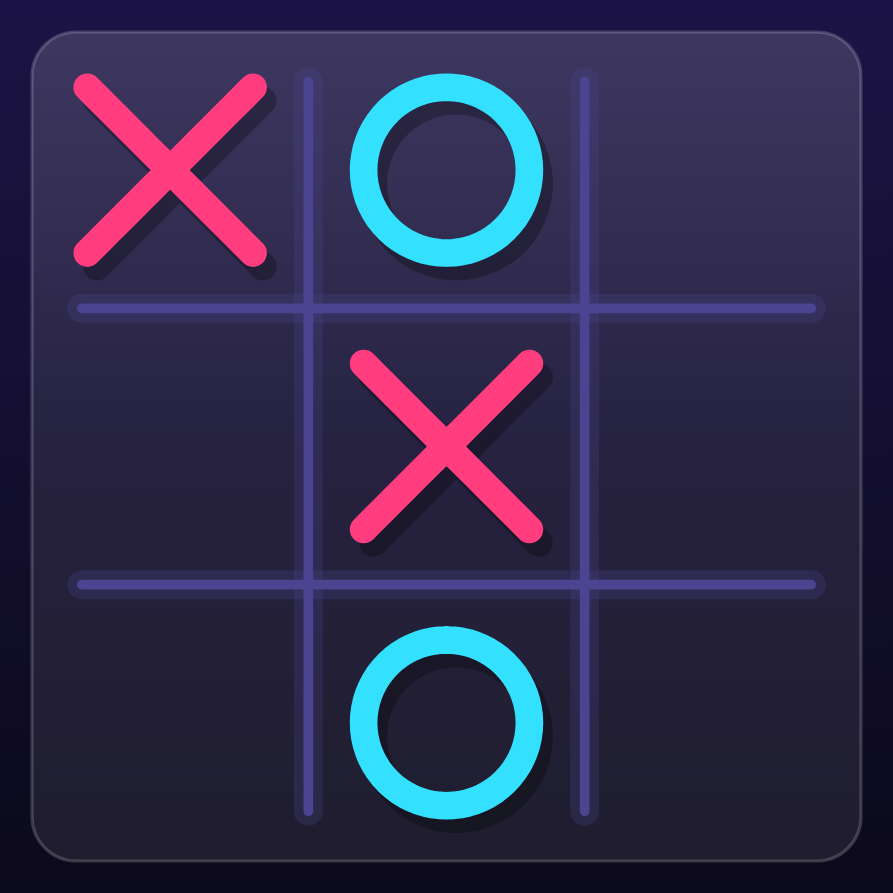
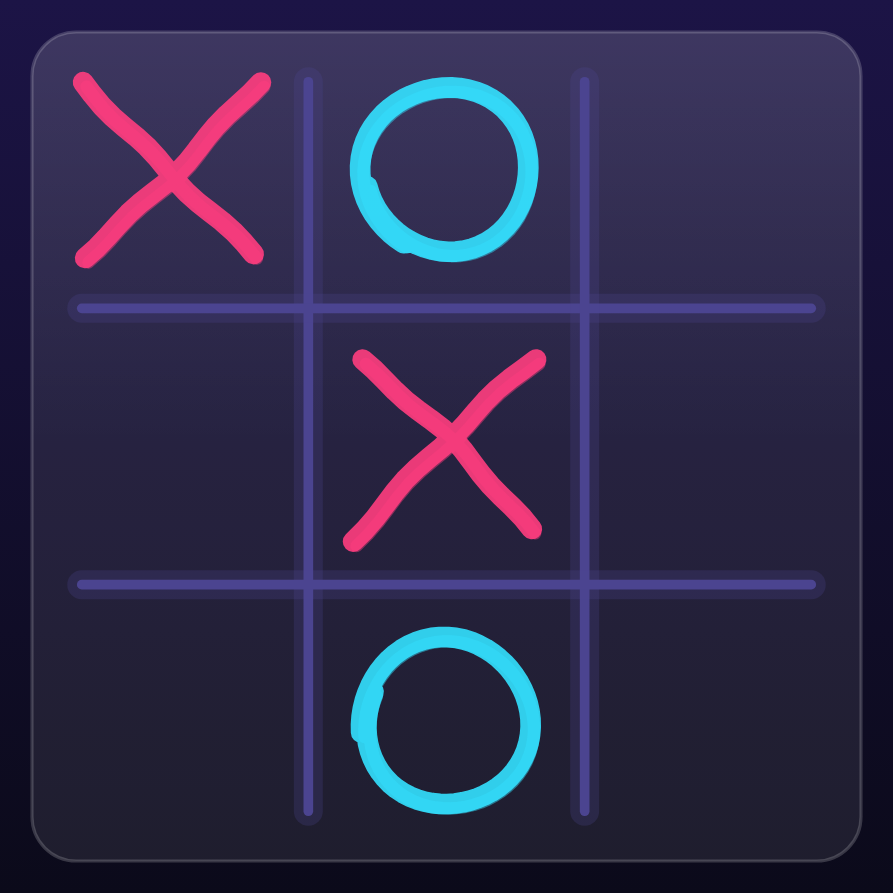
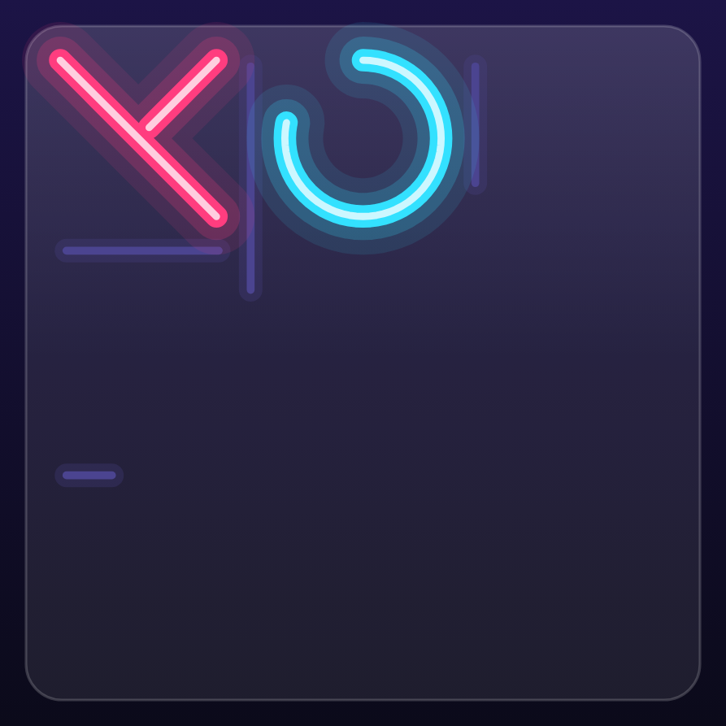

# 4. Drawing marks as polylines 🟡

An ✕ that *draws itself* stroke by stroke — and an ◯ that sweeps round — is the signature animation of TTac. This
chapter builds it from scratch, in `ui/draw/Marks.kt`. Every picture below is the real board, frozen at a moment of
its animation by a screenshot test.

<div class="shots strip" markdown>
<figure markdown="span">
{ loading=lazy }
<figcaption>80 ms</figcaption>
</figure>
<figure markdown="span">
{ loading=lazy }
<figcaption>180 ms</figcaption>
</figure>
<figure markdown="span">
{ loading=lazy }
<figcaption>300 ms</figcaption>
</figure>
<figure markdown="span">
{ loading=lazy }
<figcaption>700 ms</figcaption>
</figure>
</div>

Two animations run per mark: a **stroke** (how much of the shape is drawn) and a **pop** (a bouncy scale). At
80 ms the ✕'s first stroke has barely left its corner and the mark is still small; by 300 ms the first stroke is
done and the second is under way, and the pop has overshot past full size; at 700 ms both have settled.

## The idea: describe shapes as points, draw a fraction of them

Rather than drawing an ✕ as two `drawLine` calls, TTac describes every mark as **polylines** — lists of points in a
unit square centred on `(0, 0)`, spanning roughly `-0.3 … 0.3`:

- ✕ = two strokes of 17 points each (top-left → bottom-right, then top-right → bottom-left).
- ◯ = one stroke of 73 points around a circle, starting at the top (−90°) — you can see the ◯ above grow clockwise
  from 12 o'clock.

Unit coordinates mean the same geometry works for any cell size: multiply by the cell size and add the centre.

```kotlin
fun strokes(mark: Mark, style: MarkStyle, seed: Int): List<List<Offset>> = when (mark) {
    Mark.X -> listOf(line(Offset(-R, -R), Offset(R, R)), line(Offset(R, -R), Offset(-R, R)))
    Mark.O -> listOf(circle())
}
```

### Why points instead of `Path` + `PathMeasure`?

Compose's `PathMeasure` measures one contour at a time, and an ✕ has two. Plain point lists make "draw the first
*f* of the total length, across several strokes" a 20-line function that's trivial to unit-test — and
`GeometryTest` does exactly that.

## Drawing a fraction by arc length

```kotlin
fun partial(strokes: List<List<Offset>>, fraction: Float): List<List<Offset>> {
    var remaining = totalLength(strokes) * fraction
    for (stroke in strokes) {
        …walk segment by segment, subtracting each segment's length…
        …when a segment is longer than what's left, cut it with lerp and stop…
    }
}
```

Because it measures **length**, not point count, the pen moves at constant speed even when points are unevenly
spaced (as in the Sketch style). The ✕'s two strokes are equal, so the first finishes at exactly 50% progress —
which is why the 180 ms frame shows one complete diagonal and no second stroke yet.

The stroke progress is a 420 ms tween with `FastOutSlowInEasing` (380 ms for ◯), divided by the player's animation
speed setting.

## Three styles from one geometry

<div class="shots" markdown>
<figure markdown="span">
{ loading=lazy }
<figcaption>Neon</figcaption>
</figure>
<figure markdown="span">
{ loading=lazy }
<figcaption>Solid</figcaption>
</figure>
<figure markdown="span">
{ loading=lazy }
<figcaption>Sketch</figcaption>
</figure>
</div>

- **Neon** glows (below).
- **Solid** draws the path twice: a translucent black copy offset down-right as a shadow, then the colour.
- **Sketch** perturbs the same geometry: lines get a gentle bend (`sin(π·t)` along the stroke), a small wobble and
  random overshoot at both ends; circles spiral slightly inward and don't quite close. The randomness is **seeded**
  per cell (`Random(seed * 7919 + mark.ordinal)`), so a mark looks the same every frame instead of jittering —
  compare the two ✕s in the sketch board: each has its own, stable hand-drawn shape.

## How the neon glow is built

<figure class="single narrow" markdown="span">
{ loading=lazy }
<figcaption>Neon mid-stroke: the glow follows the pen tip exactly</figcaption>
</figure>

There's no blur filter. Glow is four strokes of the *same* path, widest and faintest first:

| Layer | Width | Colour |
|---|---|---|
| 1 | 3.4 × w | mark colour, 10% alpha |
| 2 | 2.1 × w | mark colour, 20% alpha |
| 3 | 1 × w | mark colour, opaque |
| 4 | 0.32 × w | white, 75% alpha — the "hot" core |

In the mid-stroke capture you can see the halo follow the pen tip exactly: because all four layers draw the same
partial path, the glow is never ahead of or behind the line. On the light theme the glow alpha is scaled down (60%)
and the white core dimmed, otherwise the glow reads as a smudge.

## Pop: the bouncy scale

`pop` snaps to 0.45 when a mark appears, then springs to 1 with `spring(dampingRatio = 0.32f, stiffness = 420f)`.
A damping ratio well below 1 means it **overshoots** (the 300 ms frame is visibly larger than the 700 ms one) and
settles. The stroke width is computed from the cell size *before* applying `pop`, so a popping mark keeps its line
weight.

## Going further

- **Allocation**: `partial()` allocates small lists per frame. For hundreds of marks you'd cache the full path with
  `drawWithCache` and use `PathMeasure.getSegment` per contour; at ≤25 marks, simplicity wins.
- The same `drawMark` renders the logo, the twinkling backdrop stars, game-card badges and the style preview in
  settings — one function, many uses.
