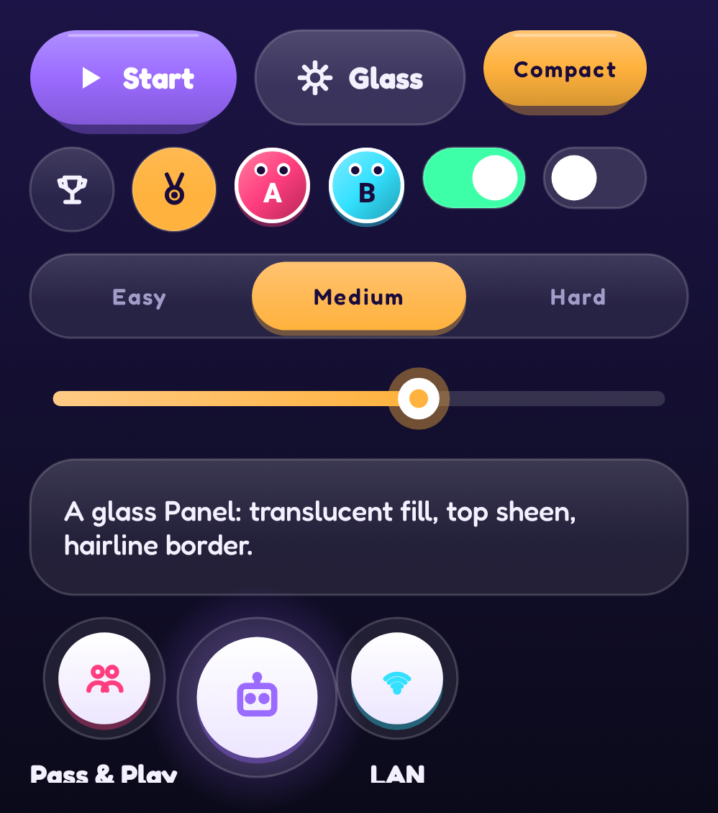
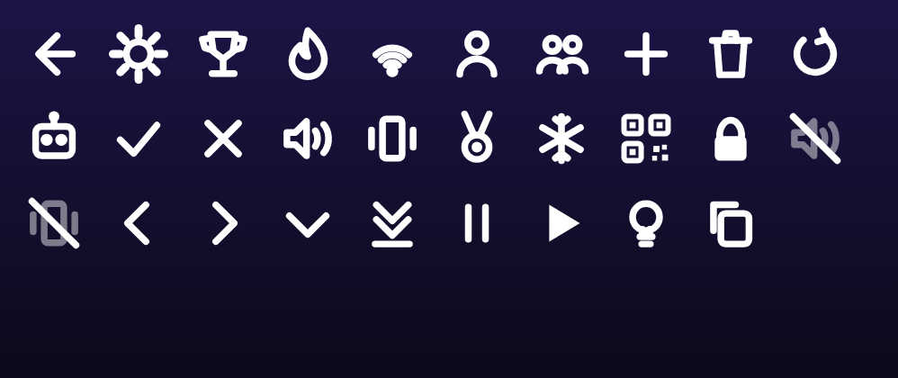
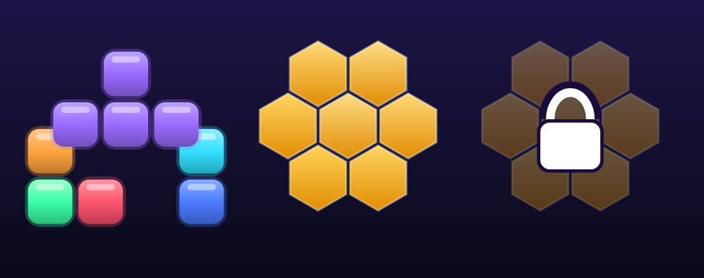

# 9. A UI kit on Canvas 🟡

TTac doesn't use Material components. Its UI kit (`ui/components/Components.kt`) is built from modifiers,
`drawBehind` and small canvases — which is how it gets a consistent bouncy, glassy look.

{ width="70%" }

## Glass

Every card, button track, chip and icon bubble in the capture above is glass — including the `Panel` with the text.
Glass is three layers drawn behind content:

```kotlin
fun DrawScope.drawGlass(palette: Palette, radius: Float, fill: Color = palette.surface, border: Color = palette.outline) {
    drawRoundRect(fill, cornerRadius = CornerRadius(radius))                                   // 1. translucent fill
    drawRoundRect(Brush.verticalGradient(listOf(white(10%), Transparent), endY = h * 0.6f), …)  // 2. sheen on top
    drawRoundRect(border, …, style = Stroke(1.2.dp.toPx()))                                     // 3. hairline
}
```

The fill is ~8% white on dark themes, 72% white on light — the backdrop shows through, which is what reads as glass.

## Bouncy press

```kotlin
fun Modifier.bouncyClick(onClick: () -> Unit) = composed {
    val scale = remember { Animatable(1f) }
    this.graphicsLayer { scaleX = scale.value; scaleY = scale.value }
        .pointerInput(Unit) {
            awaitEachGesture {
                awaitFirstDown(); launch { scale.animateTo(0.9f, spring(stiffness = High)) }   // squash
                val up = waitForUpOrCancellation()
                launch { scale.animateTo(1f, spring(dampingRatio = 0.3f, stiffness = 500f)) } // wobble back
                if (up != null) onClick()
            }
        }
}
```

The release spring is under-damped, so every tap wobbles. Scale lives in `graphicsLayer` → no recomposition.

## Segmented picker with a gooey thumb

The thumb position springs between options; while it's moving, its width grows by
`|pos − index| × w × 0.35`, so the thumb stretches like goo and snaps back when it arrives.

## Icons as strokes

{ width="80%" }

Every icon is a `Glyph` enum drawn with lines, arcs and small paths in a unit square (`drawGlyph`). No vector
drawables, and icons inherit colour and scale for free.

## Avatars, medals and art

| Medals | Locked | Arcade art |
|---|---|---|
|  |  |  |

Medals combine every technique so far: a two-tail ribbon path, a disc with a reversed inner gradient (bevel), an
emblem (star with tier pips, shield with chevrons, comeback arrow), and a **shine**: a white diagonal bar swept across
the disc inside `clipPath(disc)`. Locked medals drop to 28% alpha with a dashed rim.

## Typography

Two game fonts from the public `google/fonts` repository (OFL): **Lilita One** for titles and scores, **Fredoka**
(variable weight) for everything else. Fredoka's weights come from one file via `FontVariation.Settings`.

## Going further

- `Modifier.composed` lets a modifier own state (the scale Animatable); newer code can use `Modifier.Node` for
  lower overhead.
- Semantics matter even for Canvas UI: every `IconBubble` sets a `contentDescription`, switches set `Role.Switch`,
  segmented options set `selected` — which is also what lets UI tests and the Baseline Profile generator find them.
