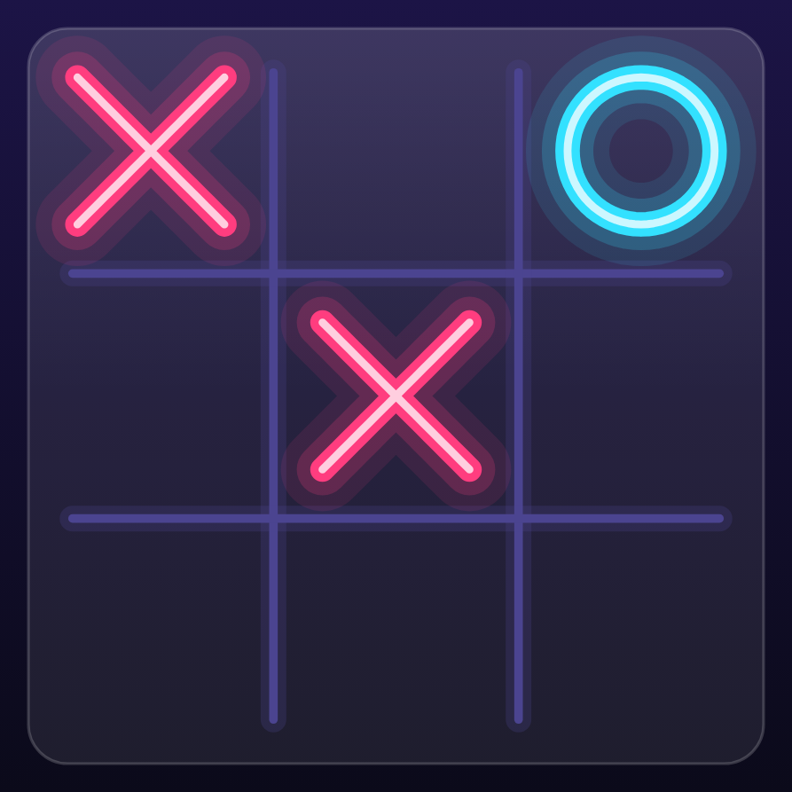
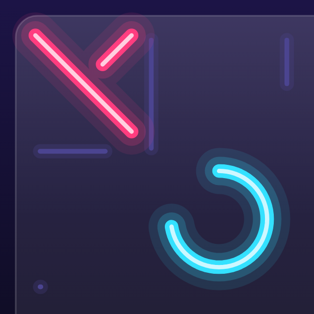

# 3. Canvas fundamentals 🟢

`Canvas(modifier) { … }` gives you a `DrawScope`: a surface with a size, a coordinate system and drawing
commands. Everything in TTac is built from about a dozen of these commands.

## Coordinates

<figure class="single narrow" markdown="span">
{ loading=lazy }
<figcaption>The board canvas: ✕ in cells 0 and 4, ◯ in cell 2</figcaption>
</figure>

- The origin `(0, 0)` is the **top-left** corner.
- **x grows right, y grows down** — the opposite of maths class for y.
- Units are **pixels**. Convert from dp with `16.dp.toPx()` (DrawScope implements `Density`).
- `size` is the canvas size; `center` is `Offset(size.width / 2, size.height / 2)`.

The picture above is the board exactly as the app renders it: a 3×3 grid with ✕ in cells 0 and 4 and ◯ in cell 2.
The board stores cells in a flat array, so cell `i` lives at row `i / n`, column `i % n`, and its centre is:

```kotlin
fun centerOf(i: Int) = Offset(
    origin.x + (i % n + 0.5f) * cell,   // column → x
    origin.y + (i / n + 0.5f) * cell,   // row → y
)
```

(`ui/draw/BoardCanvas.kt`). The `+ 0.5f` moves from the cell's top-left corner to its middle — which is where each
mark above is centred.

!!! example "Try it"
    Tapping works in reverse: `col = (x - origin.x) / cell`, `row = (y - origin.y) / cell`, then
    `index = row * n + col`. That's exactly what the board's `detectTapGestures` does.

## Primitive commands

| Command | Used in TTac for |
|---|---|
| `drawLine(color, start, end, width, cap)` | grid lines, win stroke, sparkles |
| `drawCircle(brush, radius, center)` | glows, particles, heat zones, avatars |
| `drawRect` / `drawRoundRect` | blocks, glass cards, tiles |
| `drawArc` | donut charts, glyph icons |
| `drawPath(path, brush, style)` | marks, hexagons, blobs, ripples |
| `drawText(layout, topLeft)` | letters in the hive, labels |

Every command takes either a **`Color`** or a **`Brush`** (a gradient — see [chapter 7](../drawing/effects.md)),
and a **style**: `Fill` (default) or `Stroke(width, cap, join)`.

## Strokes: caps and joins

<figure class="single narrow" markdown="span">
{ loading=lazy }
<figcaption>180 ms in: the ✕'s first stroke has a round leading tip</figcaption>
</figure>

A stroke's **cap** decides how its ends look: `Butt` stops flat at the end point, `Square` extends a half-width
square past it, and `Round` adds a half-width semicircle. TTac uses `StrokeCap.Round` everywhere — look at the
leading end of the ✕ above, captured 180 ms into drawing itself: the pen tip is round, which is a large part of the
"bouncy" feel. **Joins** (`StrokeJoin.Round`) do the same for corners inside a path.

## Paths

A `Path` is a list of drawing instructions:

```kotlin
val hex = Path().apply {
    for (i in 0 until 6) {
        val a = PI / 180 * (60 * i - 30)          // pointy-top hexagon
        val p = Offset(cx + r * cos(a), cy + r * sin(a))
        if (i == 0) moveTo(p.x, p.y) else lineTo(p.x, p.y)
    }
    close()
}
drawPath(hex, honeyGradient)
```

That's `hexPath()` from `ui/draw/ArcadeArt.kt`, which draws every honeycomb cell in Word Hive.

## Transforms

`DrawScope` can move, rotate, scale and clip everything drawn inside a block:

```kotlin
rotate(degrees, pivot) { drawMark(…) }        // spinning stars in the backdrop
scale(scaleBy, pivot) { drawPath(cell) }      // popping hive cells
clipPath(roundedBoard) { drawHeatField() }    // keep the heatmap inside the board
```

## Layering

Canvas drawing is **painter's order**: later commands paint over earlier ones. The board's `Canvas` draws, in
order: glass panel → heatmap → grid → threat glows → tap ripple → win heat → marks → win stroke → particles. Get the
order wrong and the glow covers the marks.

## Going further

- **`drawWithCache`** caches `Path`/`Brush` objects between frames when their inputs don't change.
- **`graphicsLayer`** gives a composable its own render layer (hardware-accelerated transform & alpha) — ideal for
  movement that shouldn't redraw content.
- **`BlendMode`** (e.g. `Plus`) creates additive light; TTac mostly uses alpha layering instead because additive
  blending washes out on the light theme.
