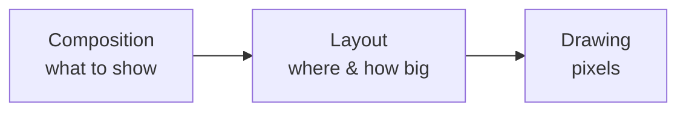

# 2. The Compose mental model 🟢

Before drawing anything, you need to know *when* Compose runs your code — because a game redraws up to 120 times a
second, and doing the wrong work in the wrong place is the #1 cause of janky Compose games.

## UI is a function of state

A composable is a function that turns state into UI:

```kotlin
@Composable
fun Score(wins: Int) {
    Txt("$wins")          // when `wins` changes, Compose calls Score again
}
```

When a `State` object that a composable *read* changes, Compose re-runs (**recomposes**) that composable. You
never call "update the label" — you change the state and the UI follows.

```kotlin
var wins by mutableIntStateOf(0)   // observable state
wins++                              // anything that read `wins` will update
```

TTac's `Match` class (`app/Match.kt`) holds the game as observable state — `board`, `turn`, `win`, scores — and the
screens simply read it.

## The three phases of a frame

Every frame, Compose runs up to three phases, in order:



| Phase | Runs your… | Re-runs when a state read *in this phase* changes |
|---|---|---|
| Composition | `@Composable` function bodies | ✔ |
| Layout | `Modifier.layout`, measure blocks | ✔ |
| Drawing | `Canvas { }`, `drawBehind { }`, `graphicsLayer { }` | ✔ |

!!! success "The single most important performance rule in this codebase"
    **Read fast-changing values in the draw phase, not in composition.**
    If an animation value is read inside `Canvas { … }`, only the drawing re-runs each frame. If it's read in the
    composable body, the whole function recomposes each frame.

Here is the rule in TTac's board (`ui/draw/BoardCanvas.kt`):

```kotlin
val winProgress = remember(roundKey) { Animatable(0f) }   // created in composition
…
Canvas(modifier) {
    val wp = winProgress.value     // ← read in the DRAW phase
    if (win != null && wp > 0f) drawWinStroke(…, wp, …)
}
```

`winProgress` changes every frame during the win animation, yet the `BoardCanvas` composable never recomposes for
it — only the Canvas lambda re-draws.

The same applies to `graphicsLayer { }` for movement and scaling:

```kotlin
Modifier.graphicsLayer {
    scaleX = scale.value     // read during drawing → no recomposition
    scaleY = scale.value
}
```

That's how every bouncy button in TTac (`Modifier.bouncyClick`) animates without recomposing.

## remember and keys

`remember { }` keeps a value across recompositions. Giving it **keys** resets it when a key changes:

```kotlin
val grid = remember(roundKey, n) { Animatable(0f) }
```

When a new round starts, `roundKey` changes, so a fresh `Animatable(0f)` is created and the grid draws itself in
again. This "reset by key" trick drives most of TTac's per-round animations.

## Side effects

Game loops, timers and one-shot animations are **side effects** — they must not run during composition. Compose's
effect APIs scope them to the composable's lifetime:

```kotlin
LaunchedEffect(g, paused) {          // restarts if the game or pause state changes
    while (!g.over && !paused) {
        delay(g.gravityMs)           // Blocks' gravity loop (arcade/blocks.md)
        g.tick()
        refresh()
    }
}
```

When the screen leaves, the coroutine is cancelled automatically — no leaked timers.

## Going further

- **Stability**: data classes of stable types (`Palette`, `MarkLook`) let Compose skip recomposing children whose
  inputs didn't change.
- **`rememberUpdatedState`**: gesture handlers capture the *latest* `onCell` callback without restarting the
  gesture detector (`BoardCanvas`).
- **Snapshot state outside UI**: `Match` uses `mutableStateOf` in a plain class; Compose observes it anywhere,
  which is why the same class is unit-tested on the JVM without Android.
