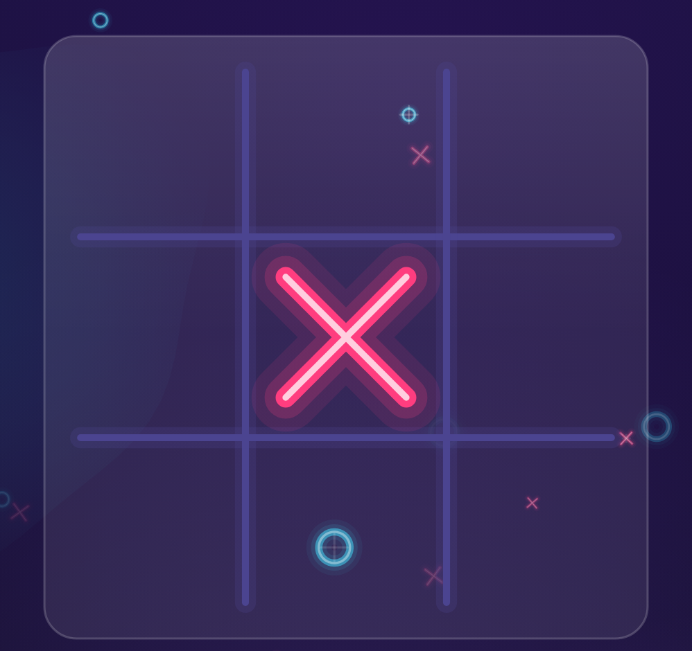
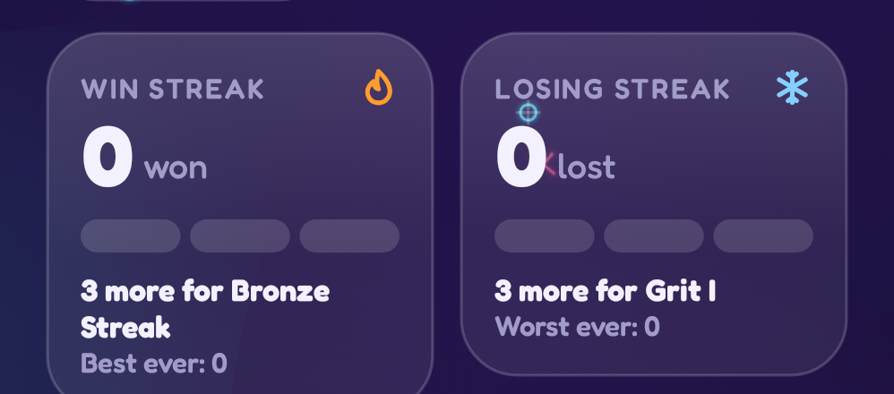
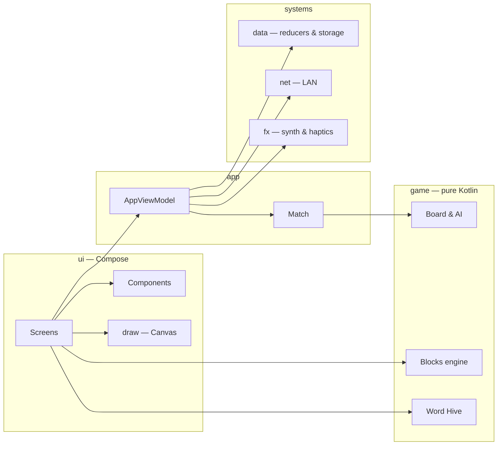

# Game development with Compose Canvas

This guide teaches game development on Android by taking apart a real, shipped game: **TTac** — a bouncy neon
Tic-Tac-Toe with an AI, LAN multiplayer, streak medals and two unlockable arcade games (a falling-block puzzle and a
honeycomb word hunt).

Everything you see in TTac is drawn with Jetpack Compose's `Canvas`: marks, boards, glows, particles, medals, even
the icons. Sounds are synthesised in code. That makes it an unusually complete teaching project — every pixel and
every sound has source you can read.

<figure class="single" markdown="span">
{ loading=lazy }
{ loading=lazy }
<figcaption>TTac's home screen — the app follows the same light/dark theme as this page</figcaption>
</figure>

<figure markdown="span">
{ loading=lazy }
<figcaption>A game in progress</figcaption>
</figure>
<figure markdown="span">
{ loading=lazy }
<figcaption>Streak meters</figcaption>
</figure>
<figure markdown="span">
{ loading=lazy }
<figcaption>Word Hive</figcaption>
</figure>

Every image in this guide is captured by a screenshot test (Roborazzi) from the app's real composables, then cropped
to the part being discussed — so it is always current.

## How to read this guide

The chapters climb from **beginner** to **pro**. Each one starts from zero, explains the idea with pictures, shows
the exact TTac code, then finishes with a "going further" section for experienced readers.

| Level | Chapters | You'll learn |
|---|---|---|
| 🟢 Beginner | 1–3 | Project setup, how Compose thinks, and drawing your first shapes on a Canvas |
| 🟡 Intermediate | 4–9 | Drawing and animating game pieces, springs, gradients, glows, particles, a UI kit |
| 🟠 Advanced | 10–16 | Pure game rules, minimax AI with alpha-beta, state machines, gestures, a falling-block engine, hex grids |
| 🔴 Pro | 17–24 | Sound synthesis, persistence with reducers, pause & resume, progression systems, LAN networking, screenshot testing, Baseline Profiles, CI/CD |

!!! tip "Follow along"
    Clone the repo and open it in Android Studio. Every chapter names the files it discusses, e.g.
    `ui/draw/Marks.kt`. Paths are relative to `app/src/main/java/io/gh/kdbrian/ttac/`.

## The big picture

The golden rule the architecture follows: **game rules never know about the screen**. `game/` is plain Kotlin that
takes a state and returns a new state. The UI only *reads* that state and *draws* it. That split is what makes the
AI testable, the Blocks engine playable by a bot in unit tests, and the drawing code free to be as flashy as it
likes.

## Where to go next

Start with [Setup & project layout](foundations/setup.md) if you're new to Android, or jump straight to
[Canvas fundamentals](foundations/canvas.md) if you already know Compose. The
[API reference](api/index.html) (generated by Dokka from KDoc) documents every public type.
