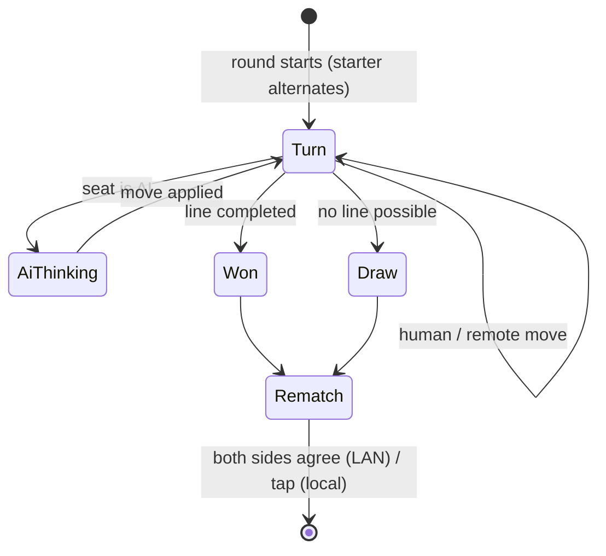

# 12. State machines & turns 🟠

A game is a state machine: *whose turn*, *is it over*, *what happens next*. TTac's `Match` (`app/Match.kt`) models a
whole sitting — many rounds between the same seats — for solo, pass-and-play and LAN.

{ width="35%" }

## States and transitions



## Seats, not modes

Instead of `if (mode == SOLO)` everywhere, each mark has a **seat** with a kind: `HUMAN`, `AI` or `REMOTE`.

```kotlin
val canTap get() = !isOver && !aiThinking && remoteGone == null && config.seat(turn).kind == SeatKind.HUMAN
```

Solo is "X human, O AI", pass-and-play is "both human", LAN is "one human, one remote". One rule covers all three.

## AI turns with coroutines

```kotlin
aiJob = scope.launch {
    val move = withContext(aiDispatcher) { Ai.chooseMove(snapshot, me, difficulty) }   // off the main thread
    delay(thinkingTime - elapsed)                                                         // feel human
    if (round == thisRound && board == snapshot) apply(move, me)                         // still valid?
}
```

The guard on the last line is essential: if the player left, started a new round or anything changed while the AI
thought, the move is thrown away.

## Untrusted input

A LAN opponent is **untrusted**. Every remote move is validated before it touches the board:

```kotlin
if (message.round != round || isOver) return                   // stale or late
if (config.seat(turn).kind != SeatKind.REMOTE) return          // not their turn
if (message.index !in 0 until board.cellCount || board[message.index] != null) return  // illegal
```

## Side effects through an interface

`Match` needs to play sounds, record stats and send network messages — but depending on Android would make it
untestable. It takes a `MatchHost` interface instead; the ViewModel implements it for real, and `MatchTest` passes a
fake that records calls.

## Going further

- Rematches over LAN are a two-phase handshake: each side sets `localRematch`/`remoteRematch`, and the round starts
  only when both are true — tested in both arrival orders.
- Observable state (`mutableStateOf`) inside a plain class lets Compose read it directly with no mapping layer.
