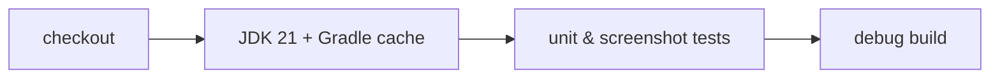

# 22. CI/CD & releases 🔴

Two GitHub Actions workflows, each with one clear job.

## `ci.yml` — verify every push and pull request



CI answers one question: *do the tests pass and does the app build?* Nothing else runs, so it's fast and its failures
are unambiguous. Test reports are uploaded only when something fails.

`gradle/actions/setup-gradle` caches dependencies and Gradle's configuration cache between runs.

## `release.yml` — tags `v*` or a manual run

**Release job**

1. Derive `versionName` from the tag (`v1.2.0` → `1.2.0`) and `versionCode` from the run number.
2. If signing secrets exist, decode the keystore to a temp file and point Gradle at it via environment variables.
3. Run the tests, then build the release **APK** and **AAB** (R8-minified, resource-shrunk, with the Baseline Profile).
4. Publish a GitHub Release with both files and auto-generated notes.

**Docs job** (runs alongside)

1. Generate the API reference with Dokka into `docs/docs/api`.
2. Build this guide with MkDocs Material in `--strict` mode (a broken link fails the build).
3. Deploy the site to GitHub Pages.

A manual run with **docs only** ticked republishes the guide without cutting a release.

## Signing lives in the environment

```kotlin
val keystorePath: String? = System.getenv("TTAC_KEYSTORE_PATH")
signingConfigs { if (keystorePath != null) create("release") { storeFile = file(keystorePath); … } }
buildTypes { release { if (keystorePath != null) signingConfig = signingConfigs.getByName("release") } }
```

No secrets in the repository, and local release builds still work (unsigned). Add `KEYSTORE_BASE64`,
`KEYSTORE_PASSWORD`, `KEY_ALIAS` and `KEY_PASSWORD` as repository secrets to sign.

```bash
git tag v1.0.0 && git push origin v1.0.0     # ship the app and the guide
```
