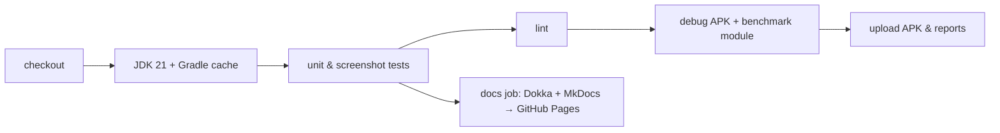

# 22. CI/CD & releases 🔴

Two GitHub Actions workflows automate everything.

## `ci.yml` — every push and pull request



- `gradle/actions/setup-gradle` caches dependencies and the configuration cache between runs.
- Test and lint reports are uploaded even when a step fails (`if: always()`), so failures are debuggable.
- On `main`, a second job builds this guide (MkDocs Material) and the API reference (Dokka) and deploys both to
  GitHub Pages.

## `release.yml` — tags `v*` or a manual run

1. Derive `versionName` from the tag (`v1.2.0` → `1.2.0`) and `versionCode` from the run number.
2. If signing secrets exist, decode the keystore to a temp file and point Gradle at it via environment variables.
3. Run the tests, build the release **APK** and **AAB** (R8-minified, resource-shrunk, with the Baseline Profile).
4. Publish a GitHub Release with both files and auto-generated notes.

Signing lives entirely in the environment:

```kotlin
val keystorePath: String? = System.getenv("TTAC_KEYSTORE_PATH")
signingConfigs { if (keystorePath != null) create("release") { storeFile = file(keystorePath); … } }
buildTypes { release { if (keystorePath != null) signingConfig = signingConfigs.getByName("release") } }
```

No secrets in the repository, and local release builds still work (unsigned).

```bash
git tag v1.0.0 && git push origin v1.0.0     # ship it
```
