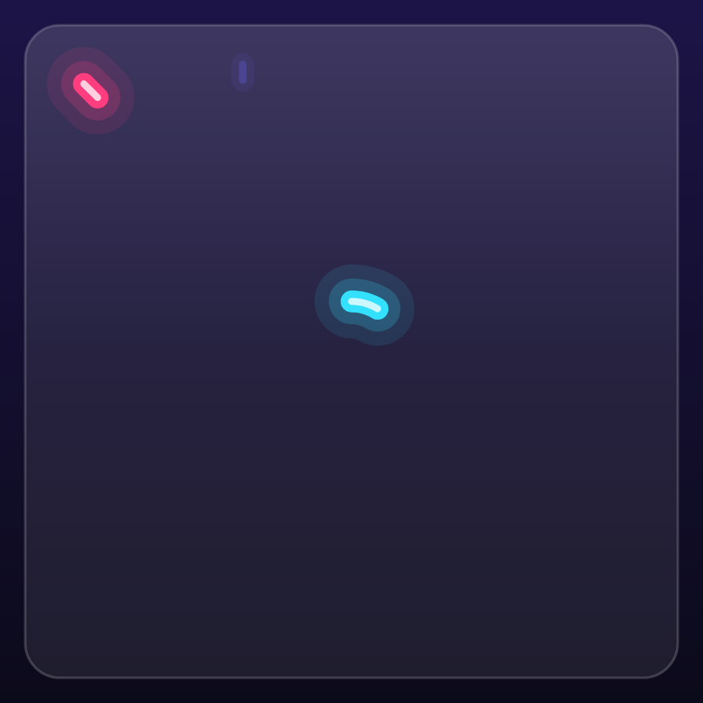

# 20. Testing & screenshot tests 🔴

TTac has three kinds of tests, each at the cheapest level that can catch its bugs.

| Kind | Runs on | Examples |
|---|---|---|
| Unit tests | JVM, milliseconds | rules, AI, reducers, protocol, geometry, Blocks, Word Hive |
| Screenshot tests (Roborazzi) | JVM + Robolectric | every image in this guide |
| Macrobenchmarks | a real device | cold start, frame timing, Baseline Profile generation |

```bash
./gradlew testDebugUnitTest      # unit + screenshot tests (capture off)
./gradlew recordRoborazziDebug   # re-record the guide's images
./gradlew verifyRoborazziDebug   # fail if rendering changed
```

## Unit tests that play the game

Because rules are pure Kotlin, tests can *play*:

- **`AiTest`** — Hard never loses 300 games against random play; Hard vs Hard always draws; the CPU blocks
  double threats on 5×5.
- **`BlocksTest`** — a greedy bot evaluates every rotation and column and clears lines until it passes the Easy
  milestone. It found no bugs the day it was written — and it will catch the day a refactor breaks line clearing.
- **`MatchTest`** — drives a whole LAN session with a fake host: illegal remote moves rejected, rematch handshake in
  both orders, AI replies on a test dispatcher.
- **`StatsReducerTest` / `ArcadeAndLanTest`** — 21 straight wins produce exactly the right medals; three Blocks wins
  unlock the hive; the LAN board tracks streaks per alias.

## Screenshot tests with Roborazzi

[Roborazzi](https://github.com/takahirom/roborazzi) renders Compose on the JVM through Robolectric's native graphics
and saves PNGs. `DocShots` (`app/src/test/.../docs/DocShots.kt`) captures the **app's own composables** — full
screens, the real `BoardCanvas`, the backdrop, medals — never test-drawn diagrams.

The key trick is a **paused clock**, which makes animations deterministic:

```kotlin
rule.mainClock.autoAdvance = false
rule.setContent { TTacTheme(ThemeMode.DARK) { BoardCanvas(…) } }
rule.mainClock.advanceTimeBy(180)                  // exactly 180 ms into the animation
rule.onRoot().captureRoboImage("docs/images/mark-frame-180.png")
```

| advanceTimeBy(80) | (180) | (300) | (700) |
|---|---|---|---|
|  |  |  |  |

Same composable, same inputs, four moments — a frame-by-frame film strip of a real animation.

!!! tip "Infinite animations"
    With `autoAdvance = true`, a test waits for the UI to be idle — which never happens with an infinite backdrop.
    Pausing the clock and advancing it manually is what makes animated screens testable.

## Going further

- `verifyRoborazziDebug` in CI turns these images into **visual regression tests**: an accidental colour or layout
  change fails the build with a diff image.
- Screens are rendered with a real `AppViewModel` on Robolectric's application, so they show live default state (the
  default profiles, a fresh hive) rather than mocked data.
