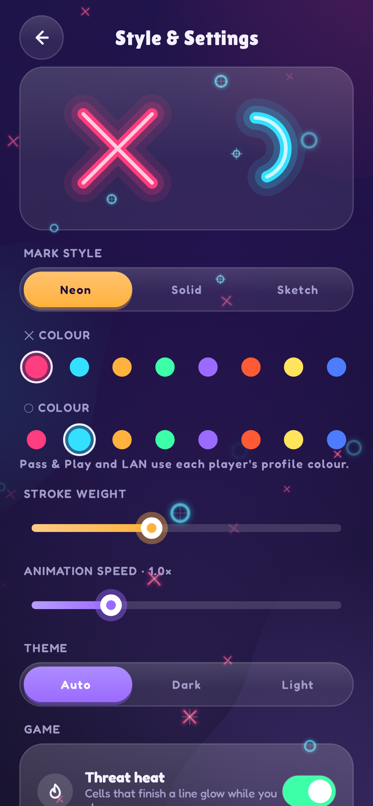

# 16. Sound synthesis & haptics 🔴

TTac ships no audio files. Every blip, chime and fanfare is **synthesised** at startup from oscillators
(`fx/Fx.kt`), and every buzz is a vibration waveform.

{ width="35%" }

## Digital audio in one paragraph

Sound is air pressure over time. Digitally, it's an array of numbers (**samples**), here 22,050 per second, each
between −1 and 1 (stored as 16-bit integers). Playing a sound means handing that array to the audio hardware.

## Oscillators

A tone at frequency *f* is a sine wave. Generating it sample by sample with a running **phase** lets the frequency
change smoothly mid-note:

```kotlin
phase += 2π * freq / SAMPLE_RATE
val wave = if (triangle) (2 / π) * asin(sin(phase)) else sin(phase)
```

- **Sine** — pure and soft (✕ placements, chimes).
- **Triangle** — `asin(sin(x))` bends a sine into straight ramps: brighter, a little "8-bit".
- **Slides** — interpolating `freq` from start to end across the note gives rising (✕) or falling (◯) chirps.

## Envelopes

A raw oscillator starts and stops with a click. An **envelope** shapes volume over the note:

```kotlin
val env = min(1.0, t / 0.004) * exp(-4.2 * progress)   // 4 ms attack, exponential decay
```

A near-instant attack plus exponential decay is a **pluck** — the sound of a tapped glass or a marimba, which is
what makes the UI feel physical.

## Composing sounds from notes

Each effect is a list of notes with start times:

| Effect | Recipe |
|---|---|
| Win | C–E–G–C arpeggio 90 ms apart, then a high E sparkle |
| Lose | two triangle notes, the second sliding down |
| Medal | a rising four-note fanfare plus two shimmering high notes |
| Blocks clear | two quick notes; a 4-line clear plays a five-note run |

The notes are mixed by **summing** samples, then clamped to [−1, 1] and scaled to 80% to leave headroom.

## Playback

Clips are rendered once (lazily) and played with `AudioTrack` in `MODE_STATIC` on a small thread pool, so overlapping
sounds don't queue behind each other.

## Haptics

Each sound has a matching `VibrationEffect`: tiny one-shots (8–22 ms) for taps and moves, waveforms for wins and
medals (`createWaveform(timings, amplitudes)`), e.g. three rising pulses then a long buzz for a medal. Sound and
haptics are toggled independently — also from quick controls on the home screen.

## Going further

- Pre-rendering costs a few milliseconds and ~100 KB of memory once; synthesising per play would cost CPU at the
  worst moment (a win).
- For richer audio: ADSR envelopes, noise for percussion, or a low-pass filter (a one-pole IIR is two lines of code).
