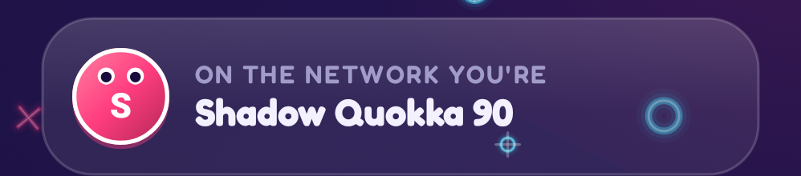
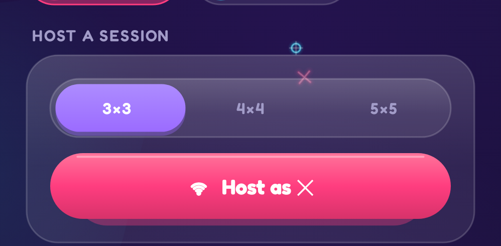
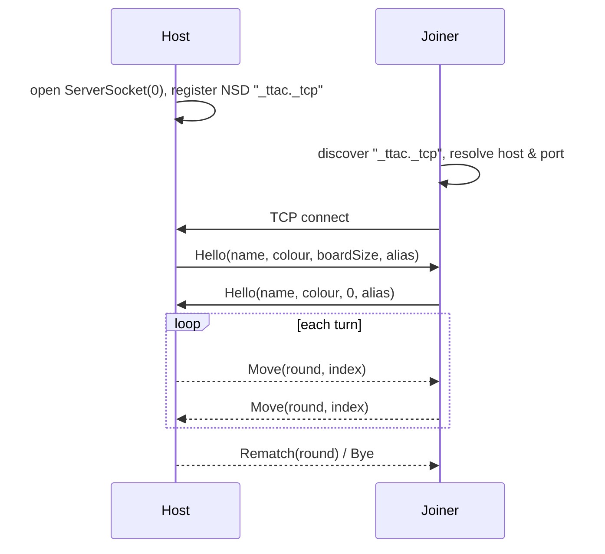

# 21. LAN multiplayer 🔴

Two phones on the same Wi-Fi play each other with no server (`net/`). This chapter covers discovery, the socket
protocol, treating the network as hostile, and hiding addresses behind friendly names.

<div class="shots" markdown>
<figure markdown="span">
{ loading=lazy }
<figcaption>Your lasting alias</figcaption>
</figure>
<figure markdown="span">
{ loading=lazy }
<figcaption>Host a session</figcaption>
</figure>
<figure markdown="span">
{ loading=lazy }
<figcaption>Join: discovery, session code, or scan a QR</figcaption>
</figure>
</div>

## Architecture



## Discovery with NSD

Android's **Network Service Discovery** (mDNS/DNS-SD) lets a phone advertise "I'm a TTac host on port N" without
anyone typing an address. The host registers `_ttac._tcp` with a service name `TTac|<alias>|<player>`; joiners browse
for that type, **resolve** each service to an address and port, and list it by alias. Resolves are queued through a
`Channel`, because older Android versions resolve one service at a time.

## A line-delimited JSON protocol

Every message is one JSON object on one line, using kotlinx.serialization's sealed-class support:

```kotlin
@Serializable sealed interface LanMessage {
    @Serializable @SerialName("hello") data class Hello(val name: String, val color: Long, val boardSize: Int, val version: Int, val alias: String)
    @Serializable @SerialName("move") data class Move(val round: Int, val index: Int)
    @Serializable @SerialName("rematch") data class Rematch(val round: Int)
    @Serializable @SerialName("bye") data object Bye
}
```

Newlines make framing trivial: read until `\n`, decode one message.

## Treat the network as hostile

- **Bounded reads** — `readBoundedLine` refuses lines over 2 KB, so a peer can't exhaust memory with an endless line.
- **Decode failures are ignored**, not thrown.
- **Every move is validated** against round, turn, bounds and occupancy (see [State machines](../logic/state-machines.md)).
- **Version check** in `Hello` rejects incompatible builds.

## Aliases, session codes and QR

Players never see IP addresses:

- Each phone gets a lasting random **alias** (adjective + animal + number, e.g. *Velvet Badger 91*) the first time
  it runs; history and streaks for LAN opponents are stored under their alias.
- A **session code** encodes the host's IPv4 address and port — 48 bits — as 10 Crockford base-32 characters
  (`K7Q2M-9XZ4P`). Crockford's alphabet drops I, L, O and U, and decoding maps look-alikes (`O→0`, `I/L→1`), so codes
  survive being read aloud.
- A **QR code** carries `ttac://join?c=<code>&a=<alias>`. It's drawn from the zxing bit matrix as rounded dots with soft
  finder eyes, with no backing card; on dark themes it's an inverted (light-on-dark) QR, which the in-app scanner
  decodes with `ALSO_INVERTED`.

<figure class="single narrow" markdown="span">
{ loading=lazy }
<figcaption>The join QR: rounded dots, soft finder eyes, no backing card</figcaption>
</figure>

## Going further

- The scanner uses CameraX `ImageAnalysis` with `STRATEGY_KEEP_ONLY_LATEST`, decoding the Y (luminance) plane
  directly with zxing — no bitmap conversion.
- `CHANGE_WIFI_MULTICAST_STATE` + a `MulticastLock` keep mDNS packets flowing on devices that filter multicast.
