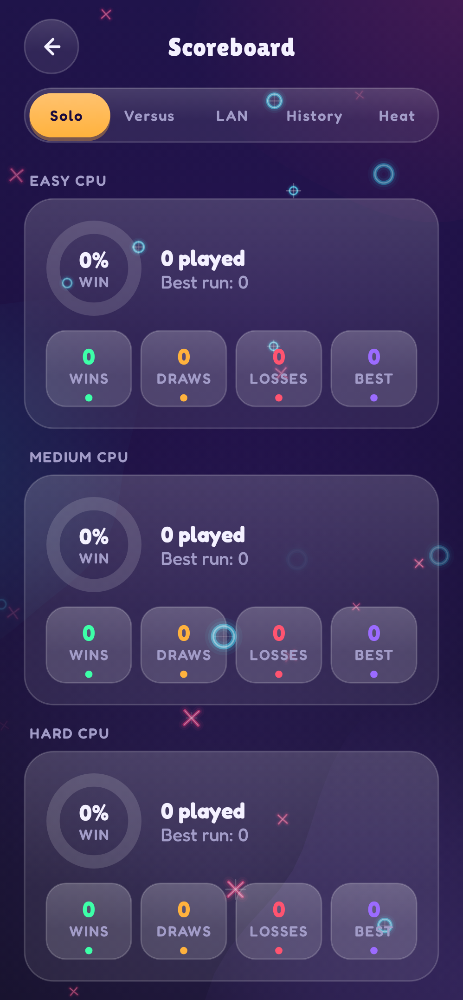

# 17. Persistence & reducers 🔴

TTac stores two kinds of data, each with the right tool:

| Data | Store | Why |
|---|---|---|
| Settings (theme, colours, toggles) | **DataStore Preferences** | small key–values, observed as a `Flow` |
| Scores, history, medals, unlocks, heat | **one JSON file** (`stats.json`) | nested structures, one atomic unit |

{ width="35%" }

## Reducers: state in, state out

All stat logic is **pure functions** in `StatsReducer` (`data/StatsRepository.kt`):

```kotlin
fun record(data: StatsData, result: MatchResult): StatsData
fun recordBlocks(data: StatsData, won: Boolean, score: Int, lines: Int): StatsData
fun recordHive(data: StatsData, points: Int, words: Int, levelCleared: Boolean): StatsData
```

A reducer takes the whole old state and an event, and returns a whole new state. That means:

- **Testable** without files or Android — `StatsReducerTest` feeds results and asserts the new state.
- **Atomic** — history, heat, streaks, medals and unlocks all update together or not at all.
- **Diffable** — "what changed?" is `new − old` (that's how newly earned medals and unlocks are detected).

## The repository

`StatsRepository` wraps the reducers with storage:

```kotlin
private fun update(transform: (StatsData) -> StatsData) {
    scope.launch(Dispatchers.IO) {
        loaded.await()                       // never write before the file has been read
        mutex.withLock {
            val next = transform(_stats.value)
            _stats.value = next              // UI updates immediately (StateFlow)
            tmp.writeText(json.encode(next))  // write a temp file…
            tmp.renameTo(file)                // …then atomically replace
        }
    }
}
```

- **Mutex** — two quick results can't interleave read-modify-write.
- **`loaded.await()`** — an early write can't clobber data that hasn't loaded yet.
- **Temp file + rename** — a crash mid-write leaves the old file intact.

## Schema evolution

Adding fields is safe: every field has a default, and the JSON parser uses `ignoreUnknownKeys`. When a new field
needs a value derived from old data, a **backfill** runs on load — e.g. `soloOverall` (your streak across all
difficulties) is rebuilt by replaying solo history:

```kotlin
val overall = history.filter { it.mode == SOLO }.asReversed().fold(Record()) { rec, m -> rec.add(outcomeOf(m)) }
```

## Going further

- Records keep win *and* loss streaks: `add(WIN)` extends the win streak and resets losses; a draw resets both.
- History is capped at 200 matches and the award log at 100, keeping the file small and fast to parse.
