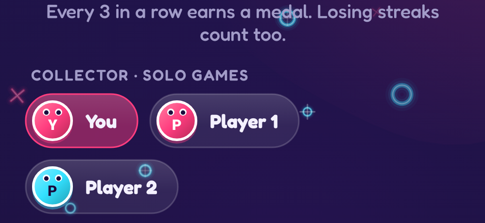
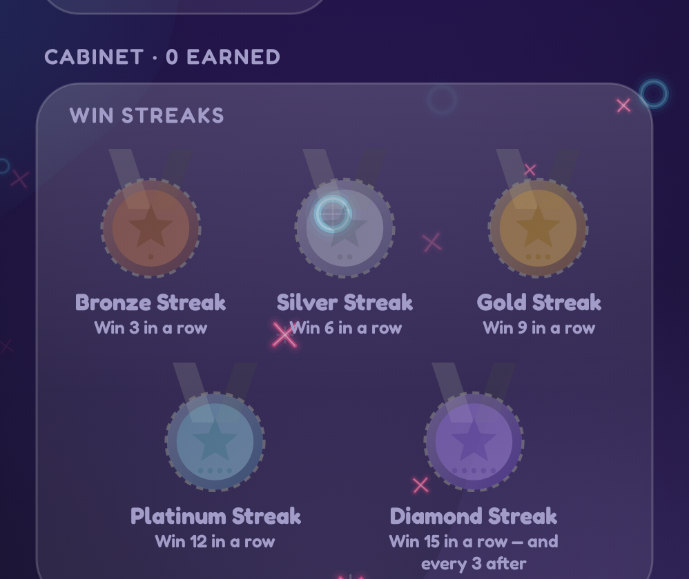
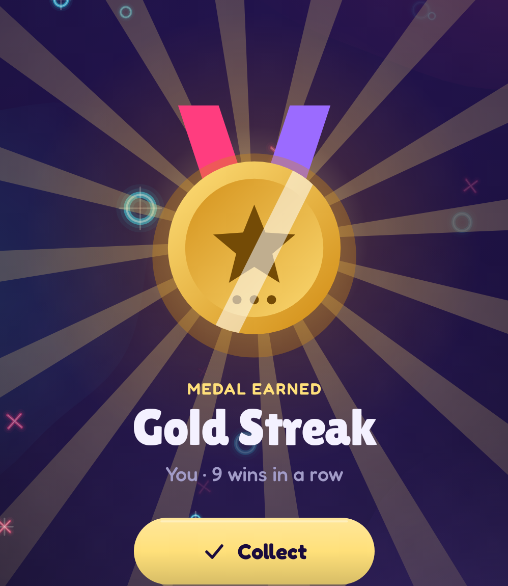

# 20. Progression — streaks, medals, unlocks 🔴

Progression gives players reasons to come back. TTac's is built from three simple rules on top of the reducers.

<div class="shots two" markdown>
<figure markdown="span">
{ loading=lazy }
<figcaption>Pick whose awards to see</figcaption>
</figure>
<figure markdown="span">
{ loading=lazy }
<figcaption>The medal cabinet</figcaption>
</figure>
</div>

## Streaks

Every record tracks four numbers: current and best **win** streak, current and worst **losing** streak. You have a
solo record ("You", across every difficulty) and each profile has a multiplayer record.

<figure class="single" markdown="span">
{ loading=lazy }
<figcaption>Win streak (heat ramp) and losing streak (cold ramp)</figcaption>
</figure>

The meters show progress toward the next medal as segments, one per game in the current gap. Filled segments take
colours from the heat ramp for wins and from a mirrored **cold ramp** for losses, and flicker harder the closer the
next medal is.

## Medals every gap

```kotlin
const val GAP = 3
BRONZE(3) SILVER(6) GOLD(9) PLATINUM(12) DIAMOND(15, then every 3)
GRIT_I(3) GRIT_II(6) GRIT_III(9, then every 3)       // losing streaks
COMEBACK                                               // win after losing ≥ 3 in a row
```

<div class="shots" markdown>
<figure markdown="span">
{ loading=lazy }
<figcaption>Earned</figcaption>
</figure>
<figure markdown="span">
{ loading=lazy }
<figcaption>Locked</figcaption>
</figure>
</div>

`Medals.earned(before, after, outcome)` compares records before and after a result and returns the medals crossed.
It's pure, so the tests can play 21 straight wins and assert exactly Bronze, Silver, Gold, Platinum and three
Diamonds.

<figure class="single" markdown="span">
{ loading=lazy }
<figcaption>Cabinet tiles: a count badge when earned more than once</figcaption>
</figure>

## Celebrations

New medals and unlocks are emitted on a `SharedFlow`; the ViewModel queues them and shows a full-screen celebration
after a short delay (so the win line finishes burning first) — rotating rays, a confetti ring, and the medal
springing in with a twist:

<figure class="single narrow" markdown="span">
{ loading=lazy }
<figcaption>A medal celebration: rays, confetti and a springy medal</figcaption>
</figure>

## Unlocks and demos

- A **10-win streak** (solo or any profile) unlocks **Blocks**.
- **3 Blocks wins in a row** unlocks **Word Hive**.
- Each locked game offers **one free demo**, spent the moment it starts, and never counted toward stats.

<figure class="single" markdown="span">
{ loading=lazy }
{ loading=lazy }
<figcaption>Locked arcade games show progress and a free try — the app follows the same light/dark theme as this page</figcaption>
</figure>

## Going further

- Unlocks survive "Reset scores"; medals and streaks don't.
- Everything is derived from recorded events, so progression can be recomputed or migrated from history at any time.
