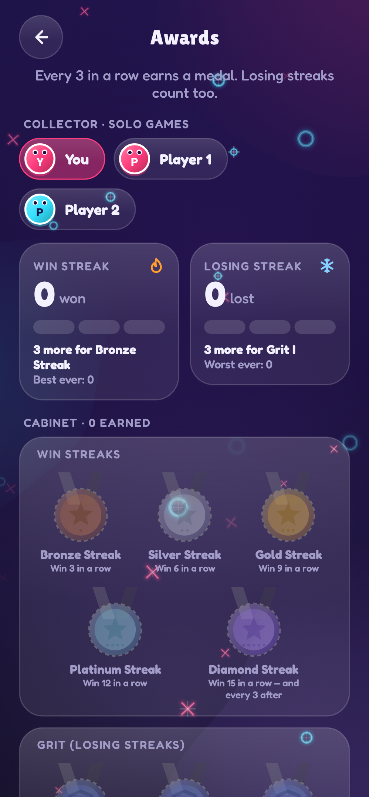
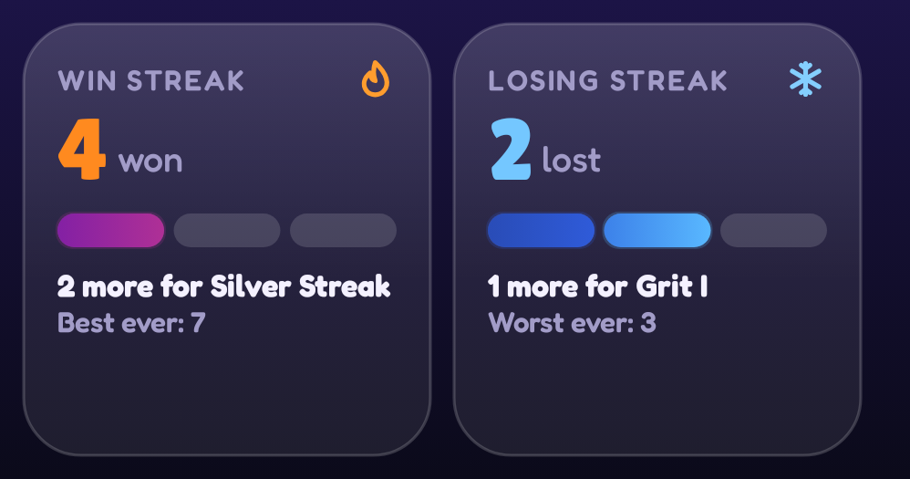
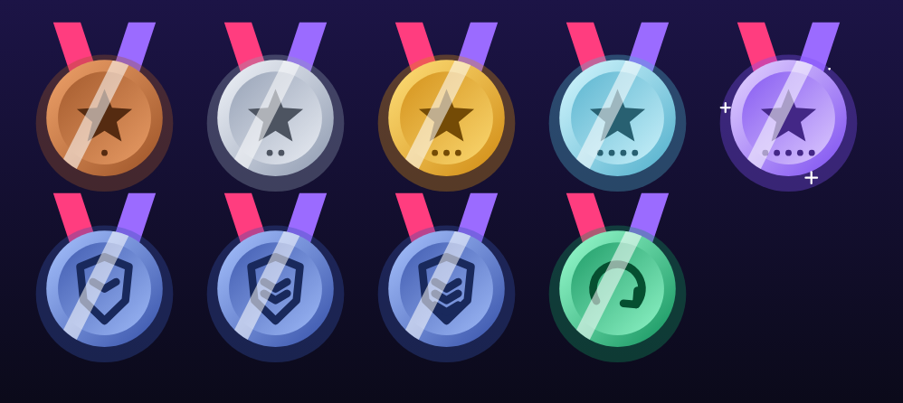
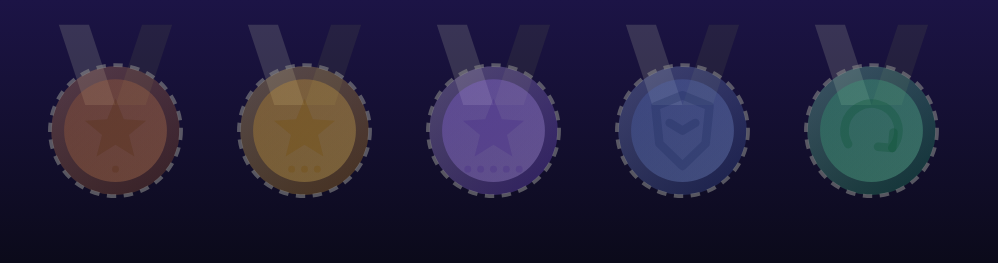
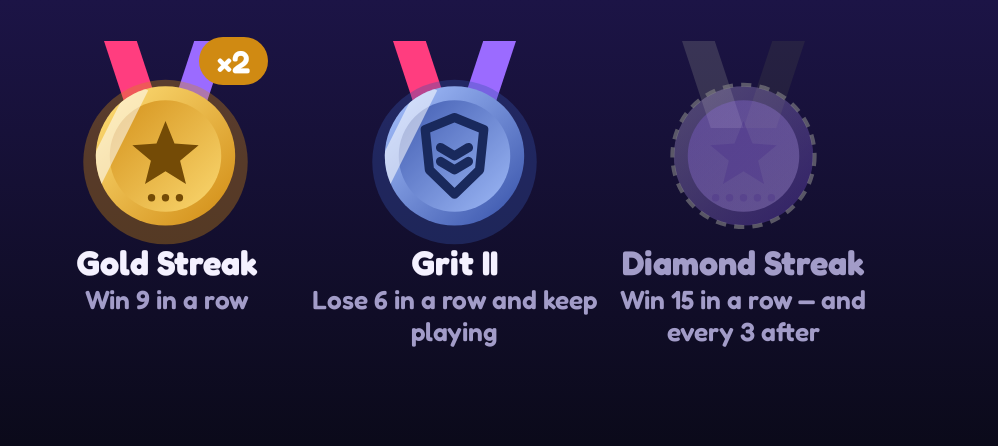
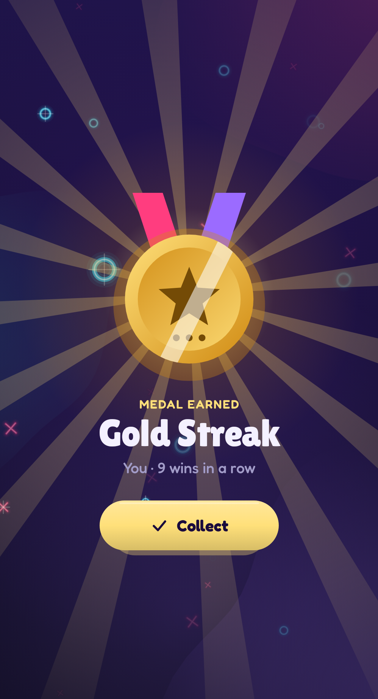
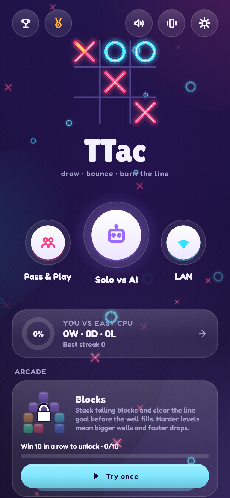

# 18. Progression — streaks, medals, unlocks 🔴

Progression gives players reasons to come back. TTac's is built from three simple rules on top of the reducers.

{ width="35%" }

## Streaks

Every record tracks four numbers: current and best **win** streak, current and worst **losing** streak. You have a
solo record ("You", across every difficulty) and each profile has a multiplayer record.

{ width="70%" }

The meters show progress toward the next medal as segments, one per game in the current gap. Filled segments take
colours from the heat ramp for wins and from a mirrored **cold ramp** for losses, and flicker harder the closer the
next medal is.

## Medals every gap

```kotlin
const val GAP = 3
BRONZE(3) SILVER(6) GOLD(9) PLATINUM(12) DIAMOND(15, then every 3)
GRIT_I(3) GRIT_II(6) GRIT_III(9, then every 3)       // losing streaks
COMEBACK                                               // win after losing ≥ 3 in a row
```

| Earned | Locked |
|---|---|
|  |  |

`Medals.earned(before, after, outcome)` compares records before and after a result and returns the medals crossed.
It's pure, so the tests can play 21 straight wins and assert exactly Bronze, Silver, Gold, Platinum and three
Diamonds.

{ width="70%" }

## Celebrations

New medals and unlocks are emitted on a `SharedFlow`; the ViewModel queues them and shows a full-screen celebration
after a short delay (so the win line finishes burning first) — rotating rays, a confetti ring, and the medal
springing in with a twist:

{ width="35%" }

## Unlocks and demos

- A **10-win streak** (solo or any profile) unlocks **Blocks**.
- **3 Blocks wins in a row** unlocks **Word Hive**.
- Each locked game offers **one free demo**, spent the moment it starts, and never counted toward stats.

{ width="35%" }

## Going further

- Unlocks survive "Reset scores"; medals and streaks don't.
- Everything is derived from recorded events, so progression can be recomputed or migrated from history at any time.
